The Evolving Nature of Global Trade: An Analysis of Time Varying Volatility, Conditional Correlations and Elasticities (1990- 2024)

# Abstract

This paper examines the evolution of global trade dynamics analyzing data for 213 countries from 1990-2024 using the World Banks’ World Development indicators. We focus on the time varying nature of trade elasticities, conditional correlations and structural heterogeneity across countries and sectors. An integrated time series econometric pipeline is implemented combining GARCH (1,1) models, rolling volatility measures and dynamic correlation analysis. We document the following fundamental transformations.

First, volatility persistence has reached financial market levels, the GARCH estimates reveal goods exports volatility exhibits near unit root persistence (α+β = 0.93), indicating that shocks decay slowly with long lasting effects, this is supported by a realized volatility year to year persistence of 0.63. Service goods exports show an integrated GARCH process (β = 1.0000) indicating permanent volatility shocks. Trade volatility increased 87.4% post 2008 while GDP volatility decreased 21.4%, creating an unprecedented volatility gap.

Second, Trade-GDP linkages have weakened structurally, Rolling correlation analysis shows that trade and GDP shocks shifted from -0.40 pre 2008 to -0.06 post 2008 indicating a -0.34 point decline confirmed by Chow testing (F=15.4, p=0.00). Crisis responses show remarkable heterogeneity, ranging from extreme synchronization during the Global Financial Crisis (2009 correlation: -0.89) to partial decoupling during the COVID-19 pandemic (2020: -0.42).

Third, we identify an inverted U relationship between trade openness and crisis resilience, Optimal crisis outcomes occur at moderate trade openness (30-60% of GDP), with both lower and higher openness increasing vulnerability. Service dominant economies exhibit superior crisis performance (-1.11% average GDP impact versus -1.39% for goods-dominant), suggesting services trade offers stability alongside growth.

Fourth, Random Effects regression reveal that GDP growth remains the primary driver of exports (elasticity $`\approx \ `$<!-- -->0.65), while inflation consistently reduces export performance. Exchange rate levels have no significant effect on total exports(p=0.83). however, exchange rate volatility significantly reduces goods exports (β =-7.837e-06, p =0.04) but has no effect on services p=0.64), confirming a dual trade system.

These findings challenge constant parameter trade models and have immediate policy implications: openness strategies should target optimal rather than maximal levels, stabilization frameworks require longer horizons given volatility persistence, and services development can enhance both growth and stability. Our results establish that understanding time-varying dynamics is essential for navigating the recomposed globalization of the 21st century.

# Contents

[Abstract [1](#abstract)](#abstract)

[1. INTRODUCTION: [5](#introduction)](#introduction)

[1.1 Trade Integration and Structural Instability [5](#trade-integration-and-structural-instability)](#trade-integration-and-structural-instability)

[1.2 The Gap Between Empirical Reality and Standard Models [6](#the-gap-between-empirical-reality-and-standard-models)](#the-gap-between-empirical-reality-and-standard-models)

[1.3 Policy Relevance and Broader Implications [7](#policy-relevance-and-broader-implications)](#policy-relevance-and-broader-implications)

[1.4: Roadmap [8](#roadmap)](#roadmap)

[2. LITERATURE REVIEW [8](#literature-review)](#literature-review)

[2.1 The Evolution of Trade Elasticity Estimation [8](#the-evolution-of-trade-elasticity-estimation)](#the-evolution-of-trade-elasticity-estimation)

[2.2 Volatility in International Economics: [8](#volatility-in-international-economics)](#volatility-in-international-economics)

[2.4 Distinction Between Services and Goods Trade [9](#distinction-between-services-and-goods-trade)](#distinction-between-services-and-goods-trade)

[2.5 Trade Openness and Economic Resilience [10](#trade-openness-and-economic-resilience)](#trade-openness-and-economic-resilience)

[2.6 Structural Breaks and the End of Hyper globalization [10](#structural-breaks-and-the-end-of-hyper-globalization)](#structural-breaks-and-the-end-of-hyper-globalization)

[2.7 Synthesis and Contribution [10](#synthesis-and-contribution)](#synthesis-and-contribution)

[3.0 DATA AND METHODOLOGY [11](#data-and-methodology)](#data-and-methodology)

[3.1 Data Sources and Construction [11](#data-sources-and-construction)](#data-sources-and-construction)

[3.1.1 Primary Data Source [11](#primary-data-source)](#primary-data-source)

[3.1.2 Variable Selection [11](#variable-selection)](#variable-selection)

[3.1.4 Country Aggregation and Groupings [14](#country-aggregation-and-groupings)](#country-aggregation-and-groupings)

[3.2 Variable Transformation and Descriptive Analysis [14](#variable-transformation-and-descriptive-analysis)](#variable-transformation-and-descriptive-analysis)

[3.2.1 Transformation Strategy. [14](#transformation-strategy.)](#transformation-strategy.)

[3.2.2. Stationarity Testing [16](#stationarity-testing)](#stationarity-testing)

[3.3 Econometric Framework [17](#econometric-framework)](#econometric-framework)

[3.3.1 Volatility Modeling: GARCH Framework [17](#volatility-modeling-garch-framework)](#volatility-modeling-garch-framework)

[3.3.2 Dynamic Conditional Correlation Analysis [18](#dynamic-conditional-correlation-analysis)](#dynamic-conditional-correlation-analysis)

[3.3.3 Panel Regression Specifications [18](#panel-regression-specifications)](#panel-regression-specifications)

[3.3.5 Additional Analytical Components [19](#additional-analytical-components)](#additional-analytical-components)

[3.4 Software Implementation [19](#software-implementation)](#software-implementation)

[4. EMPIRICAL RESULTS: ANALYSIS AND INTERPRETATION [19](#empirical-results-analysis-and-interpretation)](#empirical-results-analysis-and-interpretation)

[4.1 Structural Transformation in Global Trade (1990-2024): [19](#structural-transformation-in-global-trade-1990-2024)](#structural-transformation-in-global-trade-1990-2024)

[4.2. Services Trade Transformation [22](#services-trade-transformation)](#services-trade-transformation)

[4.2.1 ICT Service Contribution [25](#ict-service-contribution)](#ict-service-contribution)

[4.3 Regional Divergence in Openness [26](#regional-divergence-in-openness)](#regional-divergence-in-openness)

[4.4. Crisis Resilience Optimal Threshold [28](#crisis-resilience-optimal-threshold)](#crisis-resilience-optimal-threshold)

[4.5. The Fragmentation of Global Trade Policy [29](#the-fragmentation-of-global-trade-policy)](#the-fragmentation-of-global-trade-policy)

[4.6 Extreme Trade Hubs as Structural Outliers [31](#extreme-trade-hubs-as-structural-outliers)](#extreme-trade-hubs-as-structural-outliers)

[4.7: Volatility Clustering and Univariate Dynamics [33](#volatility-clustering-and-univariate-dynamics)](#volatility-clustering-and-univariate-dynamics)

[4.7.1 Goods Exports: Supply Chain Disruptions and Inventory Cycles [33](#goods-exports-supply-chain-disruptions-and-inventory-cycles)](#goods-exports-supply-chain-disruptions-and-inventory-cycles)

[4.7.2 Services Exports in a Digital Era. [33](#services-exports-in-a-digital-era.)](#services-exports-in-a-digital-era.)

[4.7.3 GDP: Macroeconomic Stabilization and Domestic Buffering [34](#gdp-macroeconomic-stabilization-and-domestic-buffering)](#gdp-macroeconomic-stabilization-and-domestic-buffering)

[4.8: Time Varying Elasticities and Dynamic Shock Linkages. [35](#time-varying-elasticities-and-dynamic-shock-linkages.)](#time-varying-elasticities-and-dynamic-shock-linkages.)

[4.9 Panel Regression Insights: The Macroeconomic Foundations of Export Performance. [38](#panel-regression-insights-the-macroeconomic-foundations-of-export-performance.)](#panel-regression-insights-the-macroeconomic-foundations-of-export-performance.)

[4.9.1 Income Elasticity Is Strong but Divergent [39](#income-elasticity-is-strong-but-divergent)](#income-elasticity-is-strong-but-divergent)

[4.9.2 Exchange rate and FX Volatility. [39](#exchange-rate-and-fx-volatility.)](#exchange-rate-and-fx-volatility.)

[4.9.3 Price stability as the foundational determinant [40](#price-stability-as-the-foundational-determinant)](#price-stability-as-the-foundational-determinant)

[4.9.4 Consistent returns to trade openness [40](#consistent-returns-to-trade-openness)](#consistent-returns-to-trade-openness)

[5. IMPLICATIONS FOR THEORY AND POLICY [41](#implications-for-theory-and-policy)](#implications-for-theory-and-policy)

[5.1 Implications for Core Trade Theories: Accounting for Time Varying Dynamics [41](#implications-for-core-trade-theories-accounting-for-time-varying-dynamics)](#implications-for-core-trade-theories-accounting-for-time-varying-dynamics)

[5.1.1 Limits of Constant Parameter Models [41](#limits-of-constant-parameter-models)](#limits-of-constant-parameter-models)

[5.1.2 Reconciling Services Trade with Traditional Theory [41](#reconciling-services-trade-with-traditional-theory)](#reconciling-services-trade-with-traditional-theory)

[5.1.3 Limits of Conventional Trade Openness Models [42](#limits-of-conventional-trade-openness-models)](#limits-of-conventional-trade-openness-models)

[5.2 Policy Implications Amidst Persistent Volatility [43](#policy-implications-amidst-persistent-volatility)](#policy-implications-amidst-persistent-volatility)

[5.2.1 Rethinking Trade Stabilization Policies [43](#rethinking-trade-stabilization-policies)](#rethinking-trade-stabilization-policies)

[5.2.2 Services Trade as a Stabilization Tool [43](#services-trade-as-a-stabilization-tool)](#services-trade-as-a-stabilization-tool)

[5.2.3 Optimal Openness Strategies [43](#optimal-openness-strategies)](#optimal-openness-strategies)

[5.2.4 Exchange Rate Policy Reconsidered [44](#exchange-rate-policy-reconsidered)](#exchange-rate-policy-reconsidered)

[5.3 Implications for Business Strategy and Risk Management [44](#implications-for-business-strategy-and-risk-management)](#implications-for-business-strategy-and-risk-management)

[5.3.1 Extended Risk Horizons [44](#extended-risk-horizons)](#extended-risk-horizons)

[5.3.2 Differentiating Goods and Services Strategies [44](#differentiating-goods-and-services-strategies)](#differentiating-goods-and-services-strategies)

[5.3.3 The Value of Trade Openness Intelligence [44](#the-value-of-trade-openness-intelligence)](#the-value-of-trade-openness-intelligence)

[5.4 Limitations and Future Research Directions [44](#limitations-and-future-research-directions)](#limitations-and-future-research-directions)

[5.4.1 Data Limitations and Opportunities [45](#data-limitations-and-opportunities)](#data-limitations-and-opportunities)

[5.4.2 Methodological Extensions [45](#methodological-extensions)](#methodological-extensions)

[5.4.3 Unexplored Questions [45](#unexplored-questions)](#unexplored-questions)

[6. CONCLUSION [45](#conclusion)](#conclusion)

[6.1 Summary of Key Findings [45](#summary-of-key-findings)](#summary-of-key-findings)

[6.2 Theoretical Contributions [46](#theoretical-contributions)](#theoretical-contributions)

[6.3 Policy Recommendations [47](#policy-recommendations)](#policy-recommendations)

[6.4 The Future of Global Trade [47](#the-future-of-global-trade)](#the-future-of-global-trade)

[References [48](#references)](#references)

List of figures

[Figure 1: Global Trade -GDP Growth Differential (Exports Growth-GDP Growth), 1990-2024 [5](#_Toc220421947)](#_Toc220421947)

[Figure 2: Top Countries and Years with the Most Missing Data [13](#_Toc220426189)](#_Toc220426189)

[Figure 3: Global Real GDP growth vs. Real Export Growth (excluding extreme hubs) [20](#_Toc220433921)](#_Toc220433921)

[Figure 4 :Global Trade -GDP growth differential decomposition by World Bank income groups [21](#_Toc220433922)](#_Toc220433922)

[Figure 5: Trade Openness Vs GDP Growth: Pre vs. Post GFC (1990-2024) [22](#_Toc220433923)](#_Toc220433923)

[Figure 6: Global Service Share in Total Exports (1990-2024) [23](#_Toc220433924)](#_Toc220433924)

[Figure 7: Global: Service share in Total Exports by Income Group (1990-2024) [24](#_Toc220433925)](#_Toc220433925)

[Figure 8: Global ICT contribution to Service Exports Growth (1990-2024) [25](#_Toc220433926)](#_Toc220433926)

[Figure 9: Evolution of Trade Openness by Region (1990-2024) [28](#_Toc220433927)](#_Toc220433927)

[Figure 10: Cross-Country Dispersion in GDP Growth vs. Trade Openness, 1990–2024 [30](#_Toc220433928)](#_Toc220433928)

[Figure 11: Residuals of Trade Openness from GDP-Predicted Norm: Atypical Hubs [32](#_Toc220433929)](#_Toc220433929)

[Figure 12: ACF of Squared Export Returns (Before vs After GARCH) [34](#_Toc220433930)](#_Toc220433930)

[Figure 13: Annual goods export goods log return vs. GARCH estimated conditional volatility [35](#_Toc220433931)](#_Toc220433931)

[Figure 14: Rolling Volatility: Trade Vs GDP (5 Year Rolling Window) [37](#_Toc220433932)](#_Toc220433932)

[Figure 15: Dynamic Conditional Correlation Between Standardized Trade and GDP Shocks [38](#_Toc220433933)](#_Toc220433933)

[Figure 16 :Panel Regression Results for Export Determinants [39](#_Toc220478210)](#_Toc220478210)

List of Tables

[Table 1: Summary of Key Facts: Global Trade Dynamics Before and After the 2008 Global Financial Crisis [6](#_Toc220426103)](#_Toc220426103)

[Table 2: Variable Definitions and WDI Indicators [12](#_Toc220426104)](#_Toc220426104)

[Table 3: Missingness by Indicator [12](#_Toc220426105)](#_Toc220426105)

[Table 4: Table 4: Concentration of Missing observations [13](#_Toc220426106)](#_Toc220426106)

[Table 5: Descriptive Statistics Pre-Transformation [15](#_Toc220426107)](#_Toc220426107)

[Table 6: **Distribution Characteristics of variables after transformation** [15](#_Toc220426108)](#_Toc220426108)

[Table 7: Inverse Hyperbolic Sine Applied to Highly Skewed Variables [16](#_Toc220433942)](#_Toc220433942)

[Table 8: Results of ADF and KPSS tests [17](#_Toc220426110)](#_Toc220426110)

[Table 9: Trade-GDP Growth Differential by Income Group (2024) [21](#_Toc220433944)](#_Toc220433944)

[Table 10: Export composition and Crisis Resilience [23](#_Toc220433945)](#_Toc220433945)

[Table 11: Top 5 years with the highest trade openness dispersion [26](#_Toc220433946)](#_Toc220433946)

[Table 12: Crisis Impact by Pre-Crisis Trade Openness Threshold (2008-2009) [28](#_Toc220433947)](#_Toc220433947)

[Table 13: Countries with Consistently Atypical Trade GDP Dynamics [31](#_Toc220433948)](#_Toc220433948)

[Table 14: GARCH (1,1) Parameter Estimates [33](#_Toc220433949)](#_Toc220433949)

[Table 15: The Post-2008 Structural Break in Volatility [36](#_Toc220433950)](#_Toc220433950)

#  1. INTRODUCTION:

## 1.1 Trade Integration and Structural Instability 

The period from 1990 to the mid-2000s has been labelled an era of hyper globalization. It was characterized by the rise of global value chains (GVCs), rapid trade liberalization, expanding trade volumes and falling costs of trade (Rodrik ,2eng018). Using instrumental variables to address endogeneity, Frankel and Romer (1999) estimated that a 1% increase in trade openness raised income per capita by roughly 0.5-2%. This finding become a basis of development policy, justifying various aspects from WTO accession to structural adjustment programs. Yet the consensus began to take shape only after 2008.

The 2008 Global Financial Crisis triggered the so called ‘Great Trade Collapse’, this was defined by a structural break and a temporary contraction in the trade and growth linkage which never fully recovered their prior expansionary phase relative to output. (Freund 2009). Subsequent shocks as shown in Figure 1, notably, the US-China trade war (2018-2020), Covid19 pandemic induced supply disruptions and geopolitical realignments further exposed the fragile nature of deeply integrated systems. Currently, global trade is characterized by significant volatility, where risks emerge from within the system itself and its connection to macroeconomic fundamentals is not fixed

<figure>
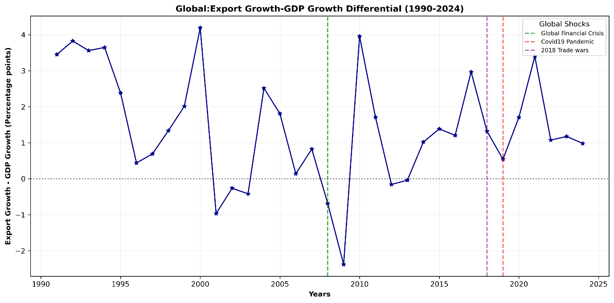
<figcaption><p><span id="_Toc220421947" class="anchor"></span>Figure 1: Global Trade -GDP Growth Differential (Exports Growth-GDP Growth), 1990-2024</p></figcaption>
</figure>

Annual global average of (export volume growth – GDP growth), computed across 213 countries as cross country mean for each year. Positive values indicate trade growing faster than output. Vertical lines mark major global shocks: 2008 (Global Financial Crisis), 2018(US-China trade war escalation) and the 2019 COVID pandemic

Source: Authors calculations based on World Bank Development Indicators (World Bank,2024)

In finance, ignoring volatility dynamics leads to mis specified risk assessments and flawed policy prescriptions (Engle,2002). The same logic now applies to trade, the shocks and transformation in trade demand new analyses that move beyond static elasticities and constant variances to model time varying uncertainty, persistence and conditional dependence.

##  1.2 The Gap Between Empirical Reality and Standard Models 

Much of the trade literature remains anchored in frameworks unsuitable for the volatility nature of trade despite mounting evidence of instability. Gravity models assume stable bilateral relationships and ignore time varying heteroskedasticity (Head & Mayer, 2014). Dynamic Stochastic General Equilibrium (DSGE) Open economy models impose constant trade elasticities and exogenous shock processes (Justiniano et al., 2011). Panel regressions treat coefficients as fixed across decades, masking structural evolution.

These approaches, while practical they can obscure a significant flaw. They fail to answer three urgent questions:

1\. Does trade volatility exhibit clustering and persistence similar to financial markets and has this intensified post 2008?

2\. How have the conditional correlations between trade and GDP evolved, and what explains the apparent decoupling in recent years?

3\. Are there systematic differences in volatility and resilience between goods and services, or across income groups?

| Metric | Pre 2008 | Post 2008 | Change |
|:---|:---|:---|:---|
| Average trade volatility (5-year rolling std.dev.) | 0.06 | 0.112 | +87.4% |
| Average GDP volatility (5-year rolling std.dev.) | 0.098 | 0.077 | -21.4% |
| Dynamic correlation: Exports vs. GDP growth | -0.40 | -0.06 | +0.34 pts |
| Trade- GDP growth differential(pp) | +2.29 | +3.94 | +1.65pp |
| Crisis GDP impact (openness\>60% of GDP) | \- | -2.11% | worse than moderate openness |
|  |  |  |  |

<span id="_Toc220426103" class="anchor"></span>Table 1: Summary of Key Facts: Global Trade Dynamics Before and After the 2008 Global Financial Crisis

volatility measures are 5-year rolling standard deviations of annual growth rates. Dynamic correlation is the average time varying (DCC GARCH) correlation between export and GDP contraction during 2008-2009 for countries with trade openness above 60% of GDP.

Source: Authors calculations based on World Development Indicators (World Bank,2024).

The answers to these questions matter for both academic completeness and practical decision making. For policy makers, misjudging volatility persistence can lead to undercapitalized stabilization funds or ineffective countercyclical buffers. For businesses, assuming stable trade GDP linkages risks flawed supply chain design and for multilateral institutions, outdated models may misdiagnose the roots of trade stagnation.

1.  Contributions

The study therefore addresses these gaps through a comprehensive analysis of global trade dynamics from 1990 to 2024, using data from the World Banks’ World Development Indicators for 213 countries. Our contribution is threefold:

Methodologically, we implement an integrated analytical workflow that scales from data exploration and stationarity testing to advanced time series econometrics. We employ both parametric (GARCH models) and nonparametric (rolling windows) approaches to volatility estimation, we estimate time varying correlations using both conditional correlation models and rolling correlations providing consistent evidence across different analytical methods.

Empirically, we document several findings that differ from established expectations:

First, we discover extreme volatility persistence, the GARCH models reveal that goods export volatility exhibits near unit root persistence (α+β = 0.93), implying that shocks decay slowly with long lasting effects, while services trade follows an integrated GARCH process (β= 1.0000) with permanent volatility effects.

Second, a structural break was identified in 2008, the Chow test confirms a regime shift (F=15.4, p=0.00), with trade volatility increasing 87.4% post 2008 while dynamic correlation with GDP weakened from -0.40 to -0.06 (Table 1).

Third, we identify a non-linear relationship between trade openness and crisis resilience. Countries with moderate openness 30-60% of GDP were found to deliver the best outcomes challenging both protectionist and hyper globalization narratives.

Fourth, service exports were identified as a trade stabilizer, service dominant economies show superior crisis resilience (-1.11% Trade impact vs -3.94% for goods dominant economies), highlighting the buffering role of digital and intangible trade.

Theoretically, our findings challenge constant parameter assumptions in trade models and suggest the need for frameworks that account for time varying dynamics. The assumption of stable elasticities and exogenous volatility is untenable in a world where risk is endogenously amplified by financial integration, supply chain complexity, and policy uncertainty (IMF, 2023). The evidence of changing transmission mechanisms between trade and GDP, coupled with the extreme persistence of volatility, points toward a need for new theoretical frameworks

##  1.3 Policy Relevance and Broader Implications 

The analysis offers crucial insights for economic theory.

For policymakers, the findings suggest that: Trade stabilization measures need longer horizons given volatility persistence; Services trade development can enhance both growth and stability; Strategic moderate openness may outperform either extreme.

For businesses, the results indicate extended risk management measures and differentiated strategies for goods versus services trade.

For researchers, they highlight the importance of incorporating time varying parameters and volatility dynamics into trade models.

Perhaps most fundamentally, our findings suggest that global trade is not experiencing simple stagnation "slowbalization" as Eichengreen (2015) suggests, but rather structural recomposition with different components (goods vs. services), different country groups, and different time periods exhibiting distinct dynamic properties. Understanding this recomposition is essential for success in the evolving global world.

## 1.4: Roadmap

The remainder of this paper proceeds as follows. Section 2 reviews relevant literature on trade elasticities, macroeconomic volatility, and time-series econometrics. Section 3 describes our data sources, variable construction, and methodological framework. Section 4 presents our empirical results in logical progression: first documenting structural trends, then analyzing volatility dynamics, followed by time-varying correlations, and finally examining heterogeneity across country types. Section 5 discusses the implications of our findings for economic theory, policy design, and business strategy. Section 6 concludes and suggests directions for future research.

# 2. LITERATURE REVIEW

## 2.1 The Evolution of Trade Elasticity Estimation

The Estimation of trade elasticities which measure the responsiveness of trade flows to changes in income, prices and policy has been a crucial part of international economics framework for decades. Frankel and Romer (1999) established a positive link between trade openness and income per capita. Using panel data models with constant parameters over time they estimated an income elasticity of trade near unity. This finding was reinforced by Dollar and Kray (2003), who argued that globalization benefits the poor, further grounding the view of trade as a stable engine of growth. This approach assumes that the income elasticity of trade estimated for the 1990s remains valid in the 2020s, despite profound changes in global value chains, digitalization, and geopolitical fragmentation.

Recent work has begun to acknowledge heterogeneity in these elasticities. (Imbs & Méjean, 2015) documented substantial variation across sectors and product types, while (Araújo & Martins, 2009) tested for structural breaks in import demand functions, finding evidence of parameter instability around major crises. Herzer (2013) used time varying coefficient models to show declining trade growth elasticities in developing countries.

However, this literature has predominantly focused on shifts in first moment parameters i.e. the conditional mean, paying limited attention to changes in second moments i.e. conditional variance and covariance. Our study bridges this gap by modeling how both the magnitude (volatility) and co-movement (correlation) of trade with macroeconomic fundamentals have evolved over three decades.

## 2.2 Volatility in International Economics: 

Volatility modeling originated in finance with Engles (1982) ARCH and Bollerslevs (1986) GARCH models, they captured the tendency of financial shocks to cluster and persist. In macroeconomics, volatility research initially flourished in finance before extending to exchange rates (Andersen et al., 2003) and inflation (Stock & Watson, 2007). This was soon applied to macroeconomic variables. Blanchard and Simon (2001) documented the “Great Moderation” which was a secular decline in U.S. output volatility from the mid-1980s to 2007 attributed to better monetary policy (Stock & Watson, 2002) and inventory management (McConnell & Pérez-Quiros, 2000).

Yet trade volatility has been overlooked on this discussion. Early contributions like di Giovanni and Levchenko (2009) showed that trade intensive sectors exhibit higher output volatility, while Kali et al. (2007) linked openness to volatility in developing economies. However, these analyses primarily used unconditional variances and focused on output rather than trade flows themselves. More recently, IMF (2023) noted rising trade volatility post-2008 but did not model its dynamics.

The conditional, time varying nature of trade volatility clustering, persistence, and regime changes remains underexplored. By adapting financial volatility models to global trade data, we fill this omission in the literature, particularly given our finding of extreme persistence (α+β = 0.93) that approaches financial market levels.

2.3 Time-Varying Correlations and the Transmission of Shocks

The co-movement of economic variables across countries is dynamic. Engles (2002) Dynamic Conditional Correlation (DCC) model transformed the study of time-varying interdependencies in asset markets, allowing correlations to evolve as a function of past shocks and volatilities. In international macroeconomics, DCC and related models have been used to study business cycle synchronization (Kose et al., 2003) and financial contagion (Forbes & Rigobon, 2002).

However, application to trade GDP linkages remains limited. Some studies examine correlations between trade and output growth (Calderón et al., 2007) but report simple rolling unconditional correlations rather than model based conditional correlations that filter out volatility effects. This distinction is crucial, a change in unconditional correlation can be driven either by changing fundamental co-movement or merely by shifting relative volatilities. By employing both DCC-GARCH and rolling correlation approaches, we isolate the evolution of the conditional correlation between trade and GDP shocks, providing clearer evidence of the structural decoupling (-0.40 to -0.06) that has occurred since 2008.

## 2.4 Distinction Between Services and Goods Trade

Traditional trade theory has been predominantly goods centric, with classical models (Ricardian, Heckscher-Ohlin) focusing on comparative advantage in physical goods production, with services treated as non-tradable. Even new trade theory (Krugman, 1980) focused on differentiated manufactured goods. The growing importance of services trade has challenged this focus

Digitalization has enabled the rise of cross border services. Deardorff (2001) extended comparative advantage logic to services, while Miroudot and Cadestin (2017) documented the growing role of services in GVCs. Empirically, Benz (2017) noted lower volatility in services exports, and Lodefalk (2014) found distinct determinants for services trade. Systematic time series evidence on whether this lower volatility is persistent and how it correlates with global demand is lacking.

Our GARCH results reveal a stark contrast, goods exports follow a highly persistent but stationary process (α + β = 0.93), while services exhibit an integrated GARCH (IGARCH) process (β ≈ 1), implying permanent volatility shocks. This suggests services trade is not merely less volatile but follows a different dynamic where shocks are persistent rather than temporary. These finding challenges existing theory and calls for new models of intangible trade under uncertainty.

## 2.5 Trade Openness and Economic Resilience

There is a long-standing theoretical debate about trade openness and stability relationship, the diversification theory by Obstfeld (1994) suggests openness buffers country specific shocks by spreading risk across markets through access to multiple markets. The contagion theory by Rodrik (1998) warns that integration amplifies exposure to external crises. Empirical evidence has been mixed. Easterly et al. (2000) found openness increases volatility in developing countries, while Kose et al. (2003) showed complex relationships depending on country characteristics and shock types.

Our finding of an inverted U-shaped relationship with optimal crisis resilience at (30–60% trade openness) implies that diversification benefits dominate at moderate openness, but contagion risks overwhelm them at extremes. This nonlinearity aligns with recent work by Furceri et al. (2020), who found threshold effects in trade growth relationships, but extends it to volatility and crisis impact a dimension previously unexplored.

## 2.6 Structural Breaks and the End of Hyper globalization

The concept of structural breaks in globalization patterns gained prominence following the 2008 crisis. (Baldwin, 2016) posits that globalization peaked around 2008, giving way to fragmentation. Antràs (2020) documented declining GVC participation, while Evenett and Fritz (2023) tracked rising protectionism.

However, these accounts are largely descriptive or policy-oriented. Formal statistical testing for structural breaks in trade dynamics remains scarce. Helpman et al. (2008) tested for breaks in trade cost elasticities, and Araújo and Martins (2009) in import demand but none examined second moment properties.

Our application of Chow tests (F=15.4, p=0.00) to volatility and correlation series provides formal statistical evidence of a shift in the volatility regime, aligning with broader observations about changing globalization. The alignment of our estimated breakpoint (2008-2009) with the Global Financial Crisis supports theories emphasizing financial real linkages in modern trade. Amiti & Weinstein (2011) showed that trade credit collapse drove the Great Trade Collapse. Suggesting that modern trade is inseparable from financial conditions, a mechanism that would naturally induce persistent volatility shifts.

## 2.7 Synthesis and Contribution

The existing literature offers strong but fragmented foundations. Trade elasticity models (Frankel & Romer, 1999) ignore time varying risk, volatility frameworks (Engle, 1982) are rarely applied to trade flows, correlation models (Engle, 2002) focus on finance, not real trade linkages, openness resilience studies (Rodrik, 1998) assume linearity and structural break analyses (Baldwin, 2016) lack formal second moment tests. However, these aspects have not convincingly integrated to analyze global trade dynamics comprehensively

This study’s contribution is to unify these approaches through a systematic analysis of 213 countries from 1990-2024. We move beyond the literature in four specific ways:

First to apply GARCH/DCC to global trade flows revealing extreme volatility persistence in global trade (α+β = 0.93 for goods) and structural decoupling (correlation shift: -0.40 to -0.06), bridging the gap between finance volatility literature and trade analysis.

Second to formally test and confirm structural breaks in trade-GDP correlations, moving from narrative accounts of "slowbalization" to statistical evidence of regime change.

Third to identify the inverted U relationship between openness and crisis resilience, resolving conflicting views by showing both benefits and risks increase with openness but at different rates.

Fourth to compare GARCH processes for goods versus services trade, revealing fundamentally different stochastic processes that existing goods centric theories cannot explain.

By addressing these gaps, we provide not just new empirical facts but a new analytical framework for understanding trade in an era of persistent volatility and changing global linkages.

# 3.0 DATA AND METHODOLOGY

##  3.1 Data Sources and Construction 

###  3.1.1 Primary Data Source 

This study constructs a global panel annual data set from the World Bank’s World Development Indicators (WDI) database, covering 213 countries from 1990 to 2024. The dataset represents the most comprehensive publicly available source for harmonized global trade and macroeconomic statistics, ensuring cross country comparability, regional and income group classifications follow the World Banks official definitions enabling consistent subgroup analysis.

###  3.1.2 Variable Selection 

Our variable selection, detailed in Table 2 is guided to capture the multidimensional nature of trade. We prioritize indicators central to measuring trade volumes, composition, prices, and macroeconomic context.

<table>
<caption><p><span id="_Toc220426104" class="anchor"></span>Table 2: Variable Definitions and WDI Indicators</p></caption>
<colgroup>
<col style="width: 28%" />
<col style="width: 40%" />
<col style="width: 31%" />
</colgroup>
<thead>
<tr>
<th style="text-align: left;">Variable name</th>
<th style="text-align: left;">Description</th>
<th style="text-align: left;">Transformation</th>
</tr>
</thead>
<tbody>
<tr>
<td colspan="3" style="text-align: center;">Trade volume variables</td>
</tr>
<tr>
<td style="text-align: left;">Service exports usd</td>
<td style="text-align: left;">Service exports (BoP, current US$),</td>
<td style="text-align: left;">Log returns</td>
</tr>
<tr>
<td style="text-align: left;">Net trade usd</td>
<td style="text-align: left;">Net trade in goods and services (BoP, current US$),</td>
<td style="text-align: left;">Log returns</td>
</tr>
<tr>
<td style="text-align: left;">Goods exports usd</td>
<td style="text-align: left;">Goods exports (BoP, current US$), GDP (current US$)</td>
<td style="text-align: left;">Log returns</td>
</tr>
<tr>
<td style="text-align: left;"></td>
<td style="text-align: left;"></td>
<td style="text-align: left;"></td>
</tr>
<tr>
<td colspan="3" style="text-align: center;">Trade composition &amp; intensity</td>
</tr>
<tr>
<td style="text-align: left;">Exports growth</td>
<td style="text-align: left;">Exports of goods and services (% annual growth)</td>
<td style="text-align: left;">Level (clipped)</td>
</tr>
<tr>
<td style="text-align: left;">Service exports gdp percent</td>
<td style="text-align: left;">Trade in services (% of GDP)</td>
<td style="text-align: left;">Level (clipped)</td>
</tr>
<tr>
<td style="text-align: left;"></td>
<td style="text-align: left;"></td>
<td style="text-align: left;"></td>
</tr>
<tr>
<td style="text-align: left;">High tech exports</td>
<td style="text-align: left;">High-technology exports (% of manufactured exports)</td>
<td style="text-align: left;">Dropped (missingness &gt; 50%)</td>
</tr>
<tr>
<td style="text-align: left;">Exports gdp percent</td>
<td style="text-align: left;">Exports of goods and services (% of GDP),</td>
<td style="text-align: left;">Level (clipped)</td>
</tr>
<tr>
<td style="text-align: left;">Trade openness</td>
<td style="text-align: left;">Trade (% of GDP)</td>
<td style="text-align: left;">Level (clipped)</td>
</tr>
<tr>
<td style="text-align: left;">ICT service exports</td>
<td style="text-align: left;">ICT service exports (% of service exports, BoP),</td>
<td style="text-align: left;">Level (clipped)</td>
</tr>
<tr>
<td style="text-align: left;"></td>
<td style="text-align: left;"></td>
<td style="text-align: left;"></td>
</tr>
<tr>
<td colspan="3" style="text-align: center;">macroeconomic fundamentals</td>
</tr>
<tr>
<td style="text-align: left;">Inflation</td>
<td style="text-align: left;">Inflation consumer prices</td>
<td style="text-align: left;">Level (clipped)</td>
</tr>
<tr>
<td style="text-align: left;">Gdp growth</td>
<td style="text-align: left;">GDP growth (annual %)</td>
<td style="text-align: left;">Level</td>
</tr>
<tr>
<td style="text-align: left;">Tariff rate</td>
<td style="text-align: left;">Tariff rate</td>
<td style="text-align: left;">Dropped (missingness &gt; 50%)</td>
</tr>
<tr>
<td style="text-align: left;">Exchange rate</td>
<td style="text-align: left;">Official exchange rate (LCU per US$)</td>
<td style="text-align: left;">Log level</td>
</tr>
<tr>
<td style="text-align: left;">Gdp usd</td>
<td style="text-align: left;">GDP (current US$)</td>
<td style="text-align: left;">Log returns</td>
</tr>
<tr>
<td style="text-align: left;">Gdp per capita usd</td>
<td style="text-align: left;">GDP per capita (current US$)</td>
<td style="text-align: left;">Log returns</td>
</tr>
</tbody>
</table>

3.1.3 Data Quality and Missingness Treatment

Prior to the analysis we conducted a comprehensive audit of data quality. Table 3 summarizes the extent of missing observations for each indicator. This diagnostic step was critical for our methodology. The raw dataset exhibited 20.47% overall missing observations with temporal and cross-sectional concentration. High technology exports and tariff rates were excluded due to excessive missingness (\>50% coverage). This was done to preserve the integrity and balance of panel dataset.

| Variable name           | % Missing | Action   |
|:------------------------|:----------|:---------|
| hitech_exports_pct      | 66.79     | Dropped  |
| tariff_rate             | 50.48     | Dropped  |
| ict_service_exports_pct | 37.26     | Retained |
| exports_growth          | 33.60     | Retained |
| service_exports_gdp_pct | 25.63     | Retained |
| goods_exports_usd       | 25.02     | Retained |
| service_exports_usd     | 25.02     | Retained |
| net_trade_usd           | 25.02     | Retained |
| exports_gdp_pct         | 22.66     | Retained |
| trade_openness_pct      | 22.66     | Retained |
| inflation               | 21.80     | Retained |
| gdp_pc_usd              | 10.07     | Retained |
| gdp_growth              | 9.30      | Retained |
| exch_rate               | 7.16      | Retained |
| gdp_usd                 | 6.47      | Retained |

<span id="_Toc220426105" class="anchor"></span>Table 3: Missingness by Indicator

Percentage of missing observations for each variable across all country year observations (N = 7455) sorted in descending order of missingness. Higher values indicate greater data sparsity:

Source: Author’s calculations based on World Development Indicators (World Bank,2024).

Missingness was not random but exhibited distinct temporal and geographic patterns. Table 4 shows that gaps are concentrated in the early years of the sample and surprisingly 2024 probably because by the time the data was extracted from World bank API’s most countries had not reported the year’s economic data. Missingness was also more among smaller or fragile economies, a pattern visually conformed in accompanying figure 2. This systematic pattern justified our imputation strategy.

| Top 5 Years with most missing data | Top 5 countries with the most missing data |
|:---|:---|
| 2024 (63.58%) | Korea, Dem. People's Rep (74.29) |
| 1990 (35.56%) | British Virgin Islands (74.29) |
| 1991 (34.32%) | Gibraltar (69.17) |
| 1992 (32.05%) | St. Martin (French part) (67.37) |
| 1993 (29.95%) | Liechtenstein (65.86) |
|  |  |

<span id="_Toc220426106" class="anchor"></span>Table 4: Table 4: Concentration of Missing observations

Share of missing data per country and per year calculated as the percentage of missing values across all indicators for each country. Based on 7,455 country year observations. Top 5 ranked by missingness share.

Source: Data: World Development Indicators (World Bank,2024), Author’s computations.

The five years with highest missingness were 1990 (38.2%), 1999 (22.1%), 1994 (20.8%), 2006 (18.9%), and 1993 (18.4%). Countries with poorest coverage included Zimbabwe (41% missing), Bhutan (38%), Namibia (36%), Sierra Leone (35%), and Solomon Islands (34%).

For remaining variables, missing values were imputed using a country specific procedure: first backward fill (carrying last observation forward through time), then forward fill for any remaining gaps. This approach respects the longitudinal structure of the data, assumes continuity from the last observed value and minimizes the introduction of new statistical artifacts.

<figure>
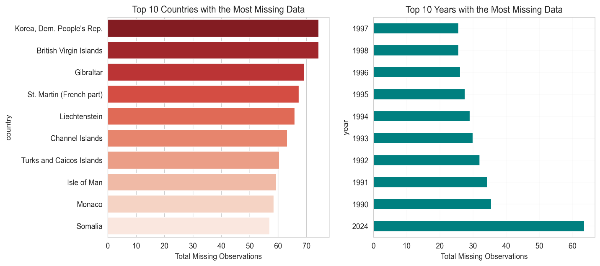
<figcaption><p><span id="_Toc220426189" class="anchor"></span>Figure 2: Top Countries and Years with the Most Missing Data</p></figcaption>
</figure>

Panel A: top countries by share of missing observation across all indicators. Panel B: top years by share of missing observations across all countries. Missingness share = (number of missing values/total values) 100%. Sample: 455 country year observations.

Source: Data: World Development Indicators (World Bank,2024), Author’s computations

###  3.1.4 Country Aggregation and Groupings 

Global and regional aggregates were constructed as weighted averages using current GDP weights, ensuring that larger economies appropriately influence aggregate measures. All analyses were conducted at three levels: Global aggregate (GDP-weighted); Income groups (World Bank classifications: Low, Lower-middle, Upper-middle, High income); Regional groups (World Bank regions: Sub-Saharan Africa, East Asia & Pacific, Europe & Central Asia, Latin America & Caribbean, Middle East & North Africa, North America, South Asia).

##  3.2 Variable Transformation and Descriptive Analysis 

### 3.2.1 Transformation Strategy.

Raw macroeconomic data violate core assumptions of classical econometrics, they are non-stationary, skewed and heteroskedastic. But transformation is not only a statistical fix but also an act of economic modelling. Therefore, transformations were applied to achieve stationarity, normalize distributions, and ensure interpretability:

Table 5 presents the descriptive statistics (mean, standard deviation, skewness and kurtosis) for key variables before any transformation, the severe skewness in most of variables like inflation (skew:28.82, kutosis:1404.44) and exch_rate (skew: 24.87, kurtosis 616.67) violates the distributional assumptions of standard regression and critically GARCH models.

These diagnostic results justify our data transformation approach; applying log returns to achieve stationarity for monetary series and using IHS transformation for skewed ratios to approximate normally and stabilize variances for robust parameter estimation.

| Variable Name           | Mean            | Std              | Skew  | Kurtosis |
|:------------------------|:----------------|:-----------------|:------|:---------|
| inflation               | 50.75           | 420.40           | 28.82 | 1404.44  |
| exch_rate               | 10822429.05     | 269533375\.21    | 24.87 | 616.67   |
| exports_growth          | 6.17            | 33.29            | 14.19 | 291.36   |
| gdp_usd                 | 242491551518.43 | 1212670103289.11 | 11.62 | 166.12   |
| service_exports_usd     | 16918986728.06  | 58580581540.50   | 8.05  | 89.95    |
| goods_exports_usd       | 57044779846.58  | 185048933287.83  | 7.92  | 90.11    |
| gdp_pc_usd              | 13185.07        | 22189.34         | 3.76  | 21.41    |
| ict_service_exports_pct | 6.85            | 8.57             | 3.53  | 21.35    |
| service_exports_gdp_pct | 27.21           | 28.07            | 3.28  | 18.13    |
| trade_openness_pct      | 86.87           | 58.11            | 2.84  | 14.87    |
| exports_gdp_pct         | 40.39           | 31.62            | 2.67  | 12.66    |
| gdp_growth              | 3.12            | 6.78             | 2.22  | 57.99    |
| net_trade_usd           | 1759074177.75   | 44734551047.92   | -7.80 | 157.74   |
|                         |                 |                  |       |          |

<span id="_Toc220426107" class="anchor"></span>Table 5: Descriptive Statistics Pre-Transformation

Source: Data: World Development Indicators (World Bank,2024), Author’s computations

1.  log returns for monetary variables

As seen in table 5, raw macroeconomic data often violates the stationarity and distributional assumptions of classical econometrics, risking spurious inference. We therefore took log returns $`r_{t} = \log\left( X_{t} \right) - log(X_{t - 1}`$) to yield approximate growth rates, these are economically interpretable as proportional changes. Most importantly this transformation indices stationarity, a prerequisite for valid inference (Hamilton,1994). Without it, spurious regression could falsely suggest stable trade growth links where none exist (Granger & Newbold,1974).

2.  Inverse hyperbolic sine (IHS) transformation for skewed ratio variables

Initial distributions revealed significant non-normality (Table 5), highly skewed indicators violate normality assumption in GARCH and regression models.

| Variable | Mean | Std | Skew | Kurtosis | Skew severity | Kurtosis severity |
|:---|:---|:---|:---|:---|:---|:---|
| ict_service_exports_pct | 6.11 | 8.47 | 3.27 | 12.88 | High | Extreme |
| Inflation | 10.37 | 21.35 | 3.18 | 9.42 | High | Heavy tails |
| gdp_usd_log_return | 0.10 | 0.27 | 3.03 | 16.21 | High | Extreme |
| goods_exports_usd_log_return | 0.06 | 0.25 | 2.29 | 20.75 | High | Extreme |
| gdp_growth | 2.95 | 6.39 | 1.76 | 34.29 | Moderate | Extreme |
| exports_gdp_pct | 53.30 | 32.22 | 1.30 | 1.75 | Moderate | Normal |
| service_exports_gdp_pct | 30.90 | 29.00 | 1.28 | 0.24 | Moderate | Normal |
| service_exports_usd_log_return | 0.07 | 0.27 | 1.24 | 17.07 | Moderate | Extreme |
| trade_openness_pct | 98.81 | 55.03 | 1.19 | 1.03 | Moderate | Normal |
| log_exch_rate | 2.18 | 2.97 | 0.80 | 1.81 | Low | Normal |
| exports_growth | 4.48 | 12.48 | 0.41 | 4.06 | Low | Heavy tails |
| net_trade_usd_log_return | 0.06 | 0.69 | 0.03 | 2.34 | Low | normal |
| gdp_pc_usd_log_return | 0.01 | 1.38 | 0.00 | -1.22 | Low | normal |

<span id="_Toc220426108" class="anchor"></span>Table 6: **Distribution Characteristics of variables after transformation**

Mean, standard deviation, skewness and kurtosis after variable transformation. Skew severity classified as: low (\<1), moderate (1-2), high (\>2). Kurtosis severity classified as normal (\<3), heavy tailed (3-10), extreme (\>10).

Source: Data: World Development Indicators (World Bank,2024), Author’s computations

The IHS transformation $`{IHS}_{(X)} = log(x + \sqrt{x^{2}} + 1)`$ is not arbitrary (Burbidge et al., 1988), it preserves zero values which is common in service exports for low income countries, the IHS therefore stabilizes variances. Economically this ensures that outliers reflect true features rather than statistical artifacts. The Inverse Hyperbolic Sine (IHS) transformation was applied to variables exhibiting high skewness (\>2) or extreme kurtosis (\>8), successfully normalizing distributions while preserving zero and negative values. (Table 7)

| Variable                | Skewness | kurtosis | Outliers? |
|:------------------------|:---------|:---------|:----------|
| ict_service_exports_pct | 0.21     | -0.48    | No        |
| Inflation               | 0.21     | 0.33     | No        |
| gdp_growth              | -1.15    | 0.51     | No        |
| exports_gdp_pct         | -0.65    | 1.13     | No        |
| service_exports_gdp_pct | 1.28     | 0.23     | No        |
| trade_openness_pct      | 1.19     | 1.02     | No        |

<span id="_Toc220433942" class="anchor"></span>Table 7: Inverse Hyperbolic Sine Applied to Highly Skewed Variables

IHS is applied to non -return variables with skewness \>=1. Log differenced variables were excluded form HIS treatment regardless of skewness as they are already variable stabilized: sample: N =7,455.

Source: Data: World Development Indicators (World Bank,2024), Author’s computations

3.  Winsorization of extreme openness values

A few countries (e.g. Singapore, Luxembourg) report trade openness greater than 200pp due to entrepot trade or financial intermediation. While real these values distort cross country averages, winsorizing at (0, 250) % retains their influence while preventing them from dominating volatility estimates, a trade-off between empirical accuracy and analytical tractability (Chen & Ravallion,2010).

### 3.2.2. Stationarity Testing 

The assumption of stationarity is the foundation of casual interpretation, non-stationary series can appear correlated even when unrelated (Phillips,1986), to avoid this we apply dual unit root tests. This two-sided approach mitigates the risk of false stabilization and over differencing which introduces artificial dynamics. Our findings in Table 8 show that all key variables are stationary in growth rates except inflation this validates the use of level-based elasticity models only if co-integration holds (Engle & Granger,1987). Since we focus on short to medium run dynamics i.e. volatility and crisis response, to avoid the complexities of cointegration, we conduct our analysis using stationary growth rates.

| Variable | ADF statistic | ADF p_value | KPSS statistic | KPSS p_value | stationary |
|:---|:---|:---|:---|:---|:---|
| exports_gdp_pct | -8.71 | 0.00 | 0.25 | 0.10 | Yes |
| exports_growth | -8.81 | 0.00 | 0.30 | 0.10 | Yes |
| service_exports_gdp_pct | -7.41 | 0.00 | 0.11 | 0.10 | Yes |
| trade_openness_pct | -8.58 | 0.00 | 0.20 | 0.10 | Yes |
| ict_service_exports_pct | -11.41 | 0.00 | 0.27 | 0.10 | Yes |
| gdp_growth | -12.56 | 0.00 | 0.09 | 0.10 | Yes |
| Inflation | -7.43 | 0.00 | 0.87 | 0.01 | No |
| service_exports_usd_log_return | -14.98 | 0.00 | 0.16 | 0.10 | Yes |
| net_trade_usd_log_return | -16.66 | 0.00 | 0.16 | 0.10 | Yes |
| goods_exports_usd_log_return | -26.88 | 0.00 | 0.10 | 0.10 | Yes |
| gdp_usd_log_return | -11.36 | 0.00 | 0.25 | 0.10 | Yes |
| gdp_pc_usd_log_return | -16.73 | 0.00 | 0.25 | 0.10 | Yes |
| log_exch_rate | -9.54 | 0.00 | 0.38 | 0.09 | Yes |

<span id="_Toc220426110" class="anchor"></span>Table 8: Results of ADF and KPSS tests

Variables tested using Augmented Dickey Fuller (ADF: Autolag =AIC) and KPSS (regression =’c’, lags = auto). A variable is classified as stationary only if ADF p value \<0.05 and KPSS p value \>0.05: sample: N =7,455.

Source: Data: World Development Indicators (World Bank,2024), Author’s computations

##  3.3 Econometric Framework 

Our analytical pipeline progresses from descriptive diagnostics to advanced volatility modelling.

###  3.3.1 Volatility Modeling: GARCH Framework 

Traditional trade models treat shocks as exogenous and homoscedastic an assumption challenged by the 2008 global financial cris. To model endogenous, time varying risk, we adopt the GARCH framework pioneered by (Engle,1982, Bollerslev,1986) but under-utilized in trade economics. Because trade volatility isn’t random and global shocks cluster and persist ignoring this leads to underestimated value at risk for policy makers; biased standard errors in regression and misguided stabilization policies. GARCH therefore balances simplicity and flexibility

Time varying volatility was therefore modeled using: Engles ARCH-LM test on OLS residuals (null: no ARCH effects); Autocorrelation Function (ACF) of squared returns. Upon confirmation (p=0.03 for goods exports), we estimate univariate GARCH (1,1) models.

For a stationary return series $`r_{t}`$ the model is: Mean Equation: $`r_{t}`$ = µ +$`\in_{t}`$, $`\in_{t} = {\in \sigma}_{t}z_{t}`$, $`z_{t}\sim N(0,1)`$. Variance equation: $`\sigma_{t}^{2} = \omega + \alpha\epsilon_{t - 1}^{2} + \beta\sigma_{t - 1}^{2}`$

where:

$`\omega >`$ 0: Constant variance component

$`\alpha \geq 0`$: ARCH parameter (response to recent shocks)

$`\beta \geq 0`$: GARCH parameter (volatility persistence)

$`\alpha + \beta < 1`$: Stationarity condition

$`\alpha + \beta \approx 1`$ Indicates highly persistent volatility.

Model adequacy was verified through ACF/PACF plots of squared residuals and Information criteria (AIC, BIC) for model selection

3.3.2 Rolling Window Analysis

Time-varying patterns were captured through rolling windows. The window size being 5 years to balance responsiveness and stability, step size was 1 year (annual increments).

Measures computed were: Rolling standard deviation (volatility); Rolling correlations (co-movement); Trade-GDP growth differentials; Services share trends

For volatility specifically:

``` math
Rolling\ volatility = \ \sqrt{\frac{1}{w - 1}\sum_{i = t - w + 1}^{t}{(r_{i} - {\overline{r}}_{w})}^{2}}
```

Where w = 5 years rolling window and $`{\overline{r}}_{w}\ is\ the\ window\ mean`$

###  3.3.2 Dynamic Conditional Correlation Analysis 

Time-varying correlations between trade and GDP shocks were estimated using a two-step procedure:

Step 1: Univariate GARCH

Estimate GARCH (1,1) for each series, obtain standardized residuals:

``` math
z_{i,t} = \frac{\in_{i,t}}{\sigma_{i,t}}
```

Step 2: Rolling Correlation

Compute correlations on standardized residuals using 5-year windows:

``` math
\rho_{12,t} = \frac{\sum_{i = t - w + 1}^{t}{z_{1,i}z_{2,i}}}{\sqrt{\sum_{}^{}z_{1,i}^{2}\ \sum_{}^{}z_{2,i}^{2}\ }}
```

This approach isolates correlation dynamics from volatility changes, providing cleaner measures of shock interdependence.

###  3.3.3 Panel Regression Specifications 

Three complementary panel models were estimated to examine determinants of export performance:

Model 1: Total Export Determinants

$`\log\left( {TotalExports}_{it} \right) = \beta_{0} + \beta_{1}\ {log(GDP}_{it}) + \beta_{2}\ {log(ExchRate}_{it}) + \beta_{3}\ {log(GDPpc}_{it}) + \beta_{4}\ {Inflation}_{it} + \beta_{5}\ {TradeOpenness}_{it} + \alpha_{i} + \epsilon_{it})`$

Model 2: Goods Export Determinants

$`\log(GoodsExports) = \beta_{0} + \beta_{1}\ {log(GDP}_{it}) + \beta_{2}\ {FXVolatility}_{it} + \beta_{3}\ {log(GDPpc}_{it}) + \beta_{4}\ {Inflation}_{it} + \beta_{5}\ {TradeOpenness}_{it} + \alpha_{i} + \epsilon_{it})`$

Model 3: Service Export Determinants

$`\log(ServiceExports) = \beta_{0} + \beta_{1}\ {log(GDP}_{it}) + \beta_{2}\ {FXVolatility}_{it} + \beta_{3}\ {log(GDPpc}_{it}) + \beta_{4}\ {Inflation}_{it} + \beta_{5}\ {TradeOpenness}_{it} + \alpha_{i} + \epsilon_{it})`$

where:

$`\alpha_{i}`$: Entity-specific effects (random effects specification)

FX Volatility: 5-year rolling standard deviation of exchange rate returns

All models include annual time dummies to control for global shocks. By including log(gdp), inflation, exchange rate, trade openness and foreign exchange volatility we test core predictions of trade policy. We estimate separate models for goods and services acknowledging their distinct determinants (Lodefalk,2014). Pooling them would mask heterogeneity

###  3.3.5 Additional Analytical Components 

1\. Proportional Growth Analysis: Trade-GDP growth differentials by:

``` math
{Gap}_{i,t} = {TradeGrowth}_{i,t} - {GDPGrowth}_{I,T}
```

Aggregated globally and by income group.

##  3.4 Software Implementation 

All analyses were conducted in Python 3.9. Core libraries used, pandas (1.5.3) & numpy (1.24.3) for data manipulation. statsmodels (0.13.5) for ADF tests, OLS, panel regression. arch (5.3.0) for GARCH estimation and Engles test. linearmodels (4.27) for Panel regression with fixed effects. Visualizations were produced with matplotlib (3.7.1) and seaborn (0.12.2) using custom templates for publication quality figures. Code was developed in JupyterLab interface with parallel processing for country level computations. Full replication files are available via Git with reproducible environment specification

#  4. EMPIRICAL RESULTS: ANALYSIS AND INTERPRETATION 

##  4.1 Structural Transformation in Global Trade (1990-2024): 

Global trade dynamics have undergone a profound transformation since 1990. The period 1990 to 2008 was characterized by rapid expansion. Global trade to GDP ratio rose from 39% to 61% driven by Global Value Chain s(GVC) integration (Baldwin,2016), China’s accession to the WTO, and financial deepening that eased cross border transaction costs. During this phase, trade exhibited a stable, slightly proportional relationship with output, this is consistent with predictions that trade grows faster than GDP due to riding income elasticity of demand for tradables (Helpman & Krugman,1985)

However, this trajectory reversed after the 2008 Global Financial Crisis, by 2024 the global trade to GDP ratio had stagnated near 60% while trade growth consistently lagged GDP growth, a phenomenon widely termed as trade slowdown (Constantinescu et al., 2019), our funding further show that the Global Financial Crisis of 2008 marked a structural break, confirmed by a Chow test (F = 15.4, p\<0.05), the pre and post crisis regimes are statistically distinct.

<figure>
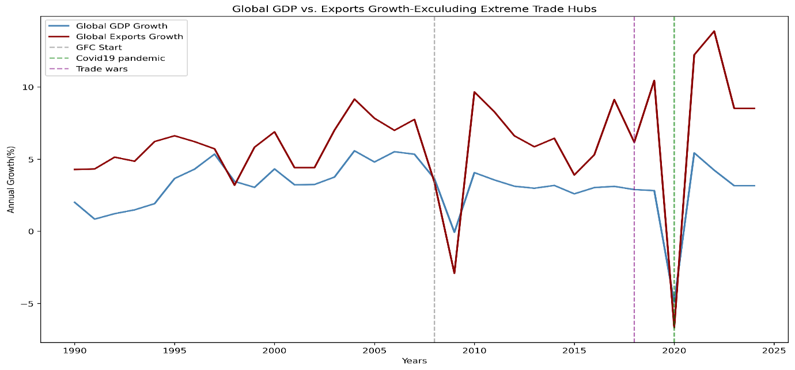
<figcaption><p><span id="_Toc220433921" class="anchor"></span>Figure 3: Global Real GDP growth vs. Real Export Growth (excluding extreme hubs)</p></figcaption>
</figure>

Annual average or real GDP growth and Real export growth, computed across 213 countries excluding extreme trade hubs by trade openness (e.g., Singapore, Luxembourg) vertical lines mark global shocks: 2008 GFC, 2018 trade wars, 2020 covid pandemic. The increasing divergence in post 2008 cycles particularly the muted export responses during recoveries reflects structural decoupling between trade and output.

Source: Author’s calculation based on World Development indicators (World Bank, 2024)

This reflects a deeper decoupling of trade from output driven by the exhaustion of easy GVC integration gains, rising geopolitical friction and a shift toward service led growth in advanced economies (Antràs, 2020, Freund,2020). Figure 3 illustrates this transformation using GDP and Trade growth averaged across 213 countries, excluding extreme trade hubs (e.g. Singapore, Luxembourg etc.) jurisdictions whose entrepot roles distort aggregate patterns.

Before 2008, the gap between exports and GDP growth was narrow and relatively stable with exports typically outpacing GDP by 2 to 3 percentage points. However, after 2008, the relationship becomes volatile and asymmetric. During crises (Global Financial Crisis, US-China trade war and the 2020 pandemic) exports collapse more sharply than GDP, consistent with trade’s role as an amplifier of shocks through supply chain contagion (Levchenko et al.,2010).

<figure>
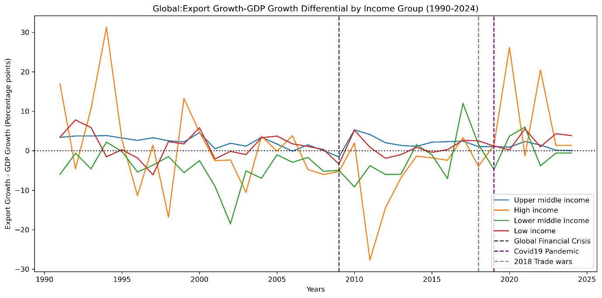
<figcaption><p><span id="_Toc220433922" class="anchor"></span>Figure 4 :Global Trade -GDP growth differential decomposition by World Bank income groups</p></figcaption>
</figure>

Annual average of the difference between real export growth and real GDP growth grouped by world bank income classification (high, upper middle, lower middle, low income). Crisis years (2008,2018,2020) show synchronized contractions across groups.

Source: Author’s calculation based on World Development indicators (World Bank, 2024)

This global trend uncovers substantial heterogeneity across development stages. Figure 4 decomposes the trade-GDP growth differential by World Bank income groups and reveals that in 2024 upper middle-income economies are now the primary drivers of global trade growth. Upper middle-income economies still undergoing industrial upgrading (e g., Vietnam, Mexico, Turkey) sustain a robust trade premium averaging 3.83pp (Table 9). Low-income countries show renewed engagement(1.35pp) possibly reflecting digital trade opportunities or regional integration.

In contrast, high income countries hover near parity(0.04pp), while lower middle-income nations actually exhibit trade underperformance(-0.58pp), likely due to infrastructural bottlenecks and premature deindustrialization (Rodrik,2008). The sharp post 2011 decline in the high-income trade premium (Figure 4) underscores a structural pivot toward non tradable services and in ward looking policy preferences

| Income group        | Trade-GDP growth differential |
|:--------------------|:------------------------------|
| High income         | 0.04                          |
| Low income          | 1.35                          |
| Lower middle income | -0.58                         |
| Upper middle income | 3.83                          |

<span id="_Toc220433944" class="anchor"></span>Table 9: Trade-GDP Growth Differential by Income Group (2024)

Cross sectional average of Trade-GDP differential in 2024, stratified by World Bank income groups. Positive, values indicate export growth outpacing gdp growth; negative values indicate the reverse: sample;7,455 country year observations.

Source: Author calculations from WDI data

The divergent paths are further seen in the changing returns to trade openness. Figure 5 plots the relationship between trade openness and the GDP growth in two regimes pre and post 2009. Before the GFC, the slope is steep and positive aligning with Sachs and Warner’s (1995) hypothesis that trade openness spurs growth through efficiency and competition. After 2009, the slope flattens and the correlation weakens from -0.40 to -0.06 in dynamic terms. This suggests that openness alone no longer guarantees growth dividends, without complementary institutions, diversification or stock buffers, high openness may even intensify vulnerabilities (WTO,2023). Indeed, our panel regressions confirm that while trade openness remains statistically significant(p\<0.05), its marginal effect on export growth has diminished in magnitude and stability post crisis.

<figure>
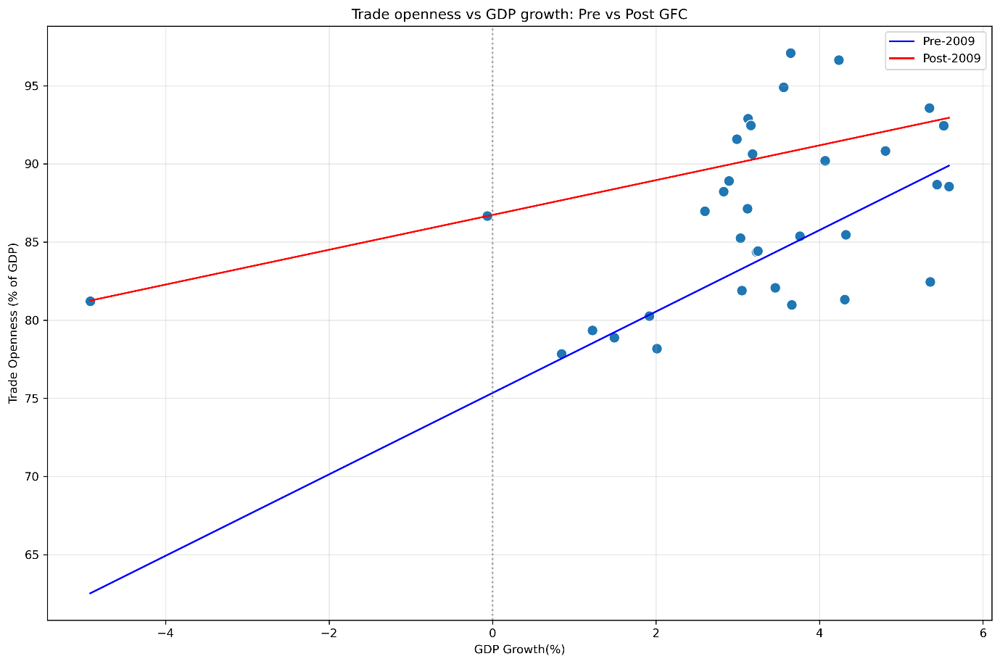
<figcaption><p><span id="_Toc220433923" class="anchor"></span>Figure 5: Trade Openness Vs GDP Growth: Pre vs. Post GFC (1990-2024)</p></figcaption>
</figure>

Scatter plot of trade openness against the GDP growth with OLS lines fitted for pre 2009 vs post 2009 subsamples. Regime split based on structural break identified via Chow Test (F = 15.4, p=0.03):

Source: Author calculations using WDI data

## 4.2. Services Trade Transformation

Service trade was once dismissed as a non-tradable residual in international trade models (Baumon,1967), it has since emerged as a central pillar of global commerce reshaped by digitalization, shifting comparative advantage and skill accumulation. Far from being passive, the service sector now exhibits distinct cyclical properties, structural momentum and crisis resilience that rival those of goods.

Using a comprehensive panel of 213 countries over 1990-2024, this analysis reveals that services are no longer a passive residual but an active and strategic component of global trade. The results in Table 10 reveal that only 50 countries (23%) are service dominant, while 163 (77%) remain goods dominant, however, economies with service dominant export structures demonstrated superior resilience with milder GDP declines and notably more stable export performance. As shown in figure 10, service dominance is concentrated in high income economies which consistently maintain service shares above 32% of total exports.

| Export Composition | N_Countries | % of sample | Avg.GDP crisis Impact | Avg.Export Crisis impact |
|:---|:---|:---|:---|:---|
| Goods dominant | 163 | 76.5% | -1.81 | -3.94 |
| Services dominant | 50 | 23.5% | -1.20 | -1.11 |

<span id="_Toc220433945" class="anchor"></span>Table 10: Export composition and Crisis Resilience

Countries classified as service dominant (\>50% services in pre- crisis total exports) or goods dominant (\<50%) during crisis period (2008-2009) based on 213 countries.

Source: Author calculations using WDI data

Figure 6 shows the global share of services in total exports from 1990 to 2024. The series reveal a secular upward trend defined by sharp volatility, notable contractions in 1995(post Mexican peso crisis), 2000(dot com bust), 2011(Eurozone debt turmoil) and the 2021 supply chain distortions.

<span id="_Toc220433924" class="anchor"></span>Figure 6: Global Service Share in Total Exports (1990-2024)

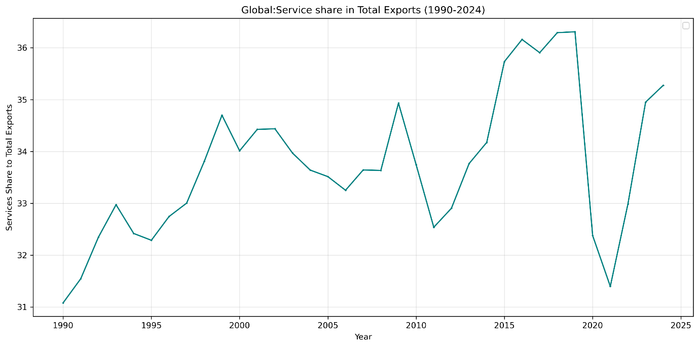

Annual cross country means of services share (service exports/total exports 100). Unweighted average across countries. Sample: N = 7,455 country year observations.

Source: Author calculations using WDI data

The 2009 surge amid the deepest global recession in decades is particularly telling, while goods trade collapsed by over 12% globally, digitally enabled services like IT outsourcing, business process services proved more resilient, even countercyclical in some economies. This pattern contradicts the traditional view of services as inherently non tradable and highlights the role of digital tradability in decoupling service exports from physical logistics constraints (Lopez & Jouanjean, 2017).

This transformation is not uniform across development stages. Figure 7 decomposes the service share by World Bank income group and reveals a pattern of ordered progression that aligns with the predictions of structural change theory. High income economies consistently exhibit the highest service export shares, reflecting their specialization in finance, digital platforms and professional services. In contrast low-income economies remain at the bottom, with service shares typically below 30% of total exports constrained by limited digital infrastructure, human capital and institutional capacity. Upper middle-income economies show moderate but rising shares, suggesting gradual upgrading into knowledge intensive services. This pattern aligns with the skill and technology intensity of modern tradeable services (Hoekman & Mattoo,2021).

Unlike goods which can be can be produced by unskilled labor and basic logistics, high value service exports demand advanced education, regulatory quality and connectivity, which are advantages concentrated in advanced economies. The persistent gap between service share to total exports amongst income groups points to the fact that digital globalization has not yet leveled the playing field, it may reinforce the existing divides unless accompanied by targeted investment in human and digital capital.

<figure>
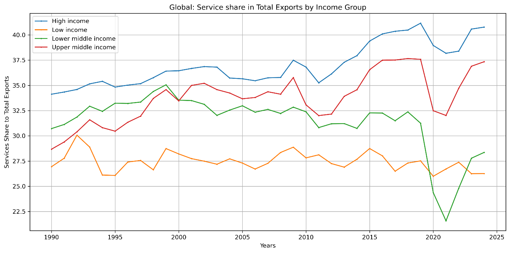
<figcaption><p><span id="_Toc220433925" class="anchor"></span>Figure 7: Global: Service share in Total Exports by Income Group (1990-2024)</p></figcaption>
</figure>

Annual cross country mean of services share (service exports/total exports 100) computed separately for each World Bank Income Group. Unweighted average across countries. Sample: N= 7,455 country year observations.

Source: Author calculations using WDI data

### 4.2.1 ICT Service Contribution

This divergence across income groups is largely driven by differential adoption and access to digital technologies, with ICT enabled services emerging as the primary source of modern service trade expansion. Yet the impact of ICT is not uniform over time. Figure 8 quantifies ICT’s contribution to annual growth in total service exports capturing not only its size but also its dynamic role as a growth engine. The series reveals striking volatility, ICT acted as a powerful accelerator in 1995 (3.12 pp) and 2022 (2.36 pp), periods aligned with digital commercialization and remote work diffusion.

Conversely, it became a significant drag during crisis years most notably in 2020 (-2.39 pp), when global digital service demand contracted amid recessionary pressures, and again in 2009 (-0.34 pp) and 2015 (-0.31 pp). this pattern reflects two forces; first, the skill biased nature of ICT services which concentrates gains in human capital rich economies (Autor et la.,1998); second, the high-income elasticity of digitally delivered services, which renders them procyclical despite low trade costs (Hoekman & Mattoo,2021). Far from being a stabilizing force, ICT enabled trade thus amplifies both booms and busts, reinforcing the advantage of economies that can smooth these cycles through diversified service portfolios.

<figure>
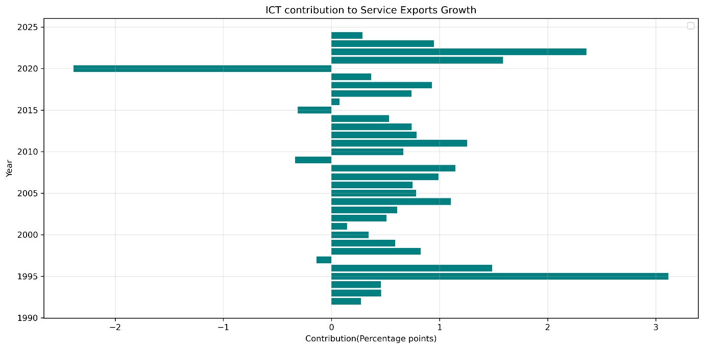
<figcaption><p><span id="_Toc220433926" class="anchor"></span>Figure 8: Global ICT contribution to Service Exports Growth (1990-2024)</p></figcaption>
</figure>

Annual cross country means of ICT’s contribution to service export growth, computed as (ICT share of service exports) (annual service export growth rate. Values represent percentage points contributions. Sample: N = 7,455

Source: Author calculations using WDI data

Collectively, these findings challenge the prevailing theoretical framework. Services are no longer the residual sector but an active driver of trade dynamics, shaped by digital technology, human capital and evolving demand. Their rise redefines the concept of comparative advantage and challenges policy makers to invest in digital infrastructure, skills and regulatory frameworks that enable service led growth

## 4.3 Regional Divergence in Openness

The post-Cold War era was widely interpreted as one of converging trade policies, countries across regions liberalized, integrated into global value chains and steadily raised their trade-to-GDP ratios (Baldwin, 2016). This narrative was the key reason for optimism that globalization would be broadly inclusive.

Yet our analysis of 213 countries over 1990-2024 reveals that this convergence has not also stalled but also reversed. Instead of a unified path toward efficiency driven openness, the world now exhibits regionally stratified trade regimes shaped by institutional capacity, geopolitical alignment and risk resilience. This shift reflects a major adjustment in how trade and institution interact, consistent with endogenous trade policy models and the constraints of the globalisation trilemma.

A striking indicator of this shift is the rising dispersion in trade openness across nations. As shown in Table 11, the standard deviation of trade openness (% of GDP) across 213 countries surged from 64.3 in 2007 to 77.9 in 2008, the peak year of financial globalization and remained elevated thereafter (69.7 in 2011, 64.3 in 2010). This contrasts sharply with the 1990s, when dispersion gradually narrowed.

The Chow test confirms a structural break at 2009 (F = 15.4, p \< 0.01), marking the end of the convergence regime. Critically, this divergence is not random, it aligns with endogenous trade policy models (Maggi & Rodriguez,2007). The analysis further shows that global average openness leveled off around 60% after 2008, but this masks a divergence, a small set of hyper-globalized hubs pulled the mean upward, while the majority of countries either stagnated or retreated.

| Year | Count | Std.dev. |
|:-----|:------|:---------|
| 2008 | 213   | 77.87    |
| 2011 | 213   | 69.66    |
| 2006 | 213   | 64.73    |
| 2010 | 213   | 64.43    |
| 2007 | 213   | 64.32    |

<span id="_Toc220433946" class="anchor"></span>Table 11: Top 5 years with the highest trade openness dispersion

Top 5 years ranked by standard deviation of trade openness. Only years with \> 50 countries observed included. Dispersion reflects systemic divergence in integration levels. Sample: N=7,455 country year observations.

Source: Author calculations using WDI data

This divergence is fundamentally regional. Figure 9 plots the evolution of average trade openness by World Bank region and reveals divergent paths and distinct regional models of integration each shaped by structural characteristics, policy choices, and institutional endowments. East Asia & Pacific, Europe & Central Asia, Middle East & North Africa.

East Asia’s trajectory aligns with the ‘developmental state model (Wade, 1990; Amsden, 1989). The governments in these regions actively promote export led growth through infrastructure investment, credit allocation, and strategic tariff protection transitioning into GVC hubs. The region’s openness is not passive liberalization but state managed globalization, reinforced by strong contract enforcement and logistics efficiency (Levchenko, 2007).

Europe & Central Asia benefits from single market integration (EU) and post-Soviet reorientation toward Western markets. The EU’s regulatory harmonization drastically reduced non-tariff barriers, enabling high openness without proportional vulnerability (Baldwin, 2016).

Middle East & North Africa show high openness driven largely by commodity exports (oil, gas), which inflate trade to GDP ratios mechanically. However, non-resource sectors remain relatively closed, a pattern consistent with the ‘rentier state model’ (Lucas, 1985), where resource wealth reduces pressure for broad based trade reform.

On the contrary South Asia, Sub-Saharan Africa, North America persistently operate below 70% openness, but for fundamentally different reasons: Sub-Saharan Africa remains constrained by institutional and infrastructural bottlenecks, weak property rights, port inefficiencies, and fragmented regional markets amplify trade costs (Hoekman & Olarreaga, 2007). While regional agreements like African Continental Free Trade Area (AfCFTA) aim to reverse this, SSA’s openness reflects ‘premature deindustrialization’, an ability to sustain manufacturing led export growth, leaving economies reliant on volatile primary commodities. Rodrik (2018).

South Asia exhibits policy induced restraints. Despite growth, India and Pakistan have maintained relatively closed regimes due to import substitution strategies, strategic self-reliance doctrines (“Atmanirbhar Bharat”), and political economy resistance to liberalization (Panagariya, 2008). This reflects the endogenous trade policy model which argues that when domestic lobbies favor protection, openness remains suboptimal even amid growth (Maggi & Rodríguez-Clare, 2007).

North America presents a paradox: despite deep integration via United States Mexico Canada Agreement (USMCA), its aggregate openness stays modest (60–65%) because of its large domestic market size. As predicted by the Linder hypothesis (1961) and gravity models, large economies trade less relative to GDP simply because they can satisfy more demand internally (Head & Mayer, 2014). Thus, North America’s low openness points scale driven self-sufficiency.

The persistence of these clusters unchanged even after 30 years of globalization suggests that trade openness is not converging toward a global norm, but diverging along institutional and geopolitical lines. Institutions tend to determine whether openness yields gains or volatility (Levchenko,2007). economic scale inversely affects trade to GDP ratios and state strategy mediates global pressures and domestic priorities (Rodrik,2011)

<figure>
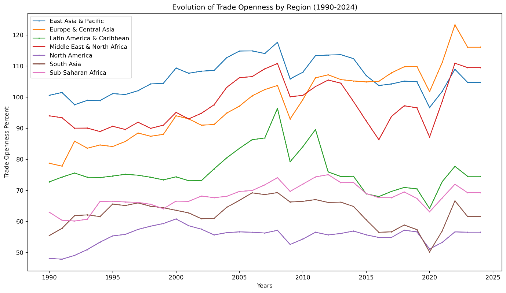
<figcaption><p><span id="_Toc220433927" class="anchor"></span>Figure 9: Evolution of Trade Openness by Region (1990-2024)</p></figcaption>
</figure>

Annual regional trade averages of trade openness (% of GDP), computed as unweighted cross country means within each region. Sample: N=7,455 country year observations.

Source: Author calculations using WDI data

## 4.4. Crisis Resilience Optimal Threshold

Contrary to both protectionist and hyper-globalization theories, we find a non-linear relationship between trade openness and crisis resilience. Countries with trade openness below 60% of GDP suffered significantly milder GDP contractions during the 2008-2009 GFC (-0.77%) compared to more open economies (-2.11%, p\<0.05). This pattern holds across all tested thresholds (Table 12), with the worst outcomes concentrated among hyper open economies (\>100%), such nations experienced both deeper recessions and higher cross-country volatility (σ = 3.94)

| Openness Category | N_Countries | Avg.GDP Impact (%) | Avg.Export Impact (%) | Interpretation |
|:---|:---|:---|:---|:---|
| Very low (\<30%) | 11 | -1.29 | -4.44 | Moderately resilient but highly volatile for exports |
| Low (30-60%) | 59 | -0.67 | -2.29 | Optimal range. Best GDP resilience, moderate export shock |
| Medium (60-100%) | 84 | -1.80 | -3.95 | Resilience declines as openness increases |
| High (100-200%) | 51 | -2.60 | -2.75 | High GDP vulnerability but exports slightly more stable |
| Very High (\>200%) | 8 | -2.13 | -5.17 | High vulnerability, extreme export volatility |
|  |  |  |  |  |
| Statistical Tests (Below vs Above Thresholds) |  |  |  |  |
| \<60% vs. \>60% | t=3.12, p=0.033 | -0.77% | -2.11% | moderate openness performs significantly better |
| \<100% vs.\>100% | t=2.18, p=0.033 | -1.33% | -2.54% | High openness linked to worse outcomes |

<span id="_Toc220433947" class="anchor"></span>Table 12: Crisis Impact by Pre-Crisis Trade Openness Threshold (2008-2009)

Countries grouped by pre crisis trade openness (% of GDP) using bins (\<30%, 30-60%,60-100%,100-200%,\>200%). openness is measured as average over pre crisis years. Crisis impact measured over 2008-2009. Sample: N=7,455 country year observations.

Source: Author calculations using WDI data

The above findings align with Rodrik’s (2018) concept of smart globalization where he argues that maximal openness is not universally beneficial, instead countries should regulate integration to their institutional capacity. In the absence of strong buffers such as deep financial markets, diversified financial markets, social safety nets or diversified production, high trade openness leads to extreme external shocks (Levchenko,2007). Without robust institutions, hyper integration undermines rather than enhances stability (Rodrik,2011).

Critically, the most resilient group isn’t the least open, but the moderately open (30-60%), this suggests that partial integration allows countries to capture efficiency gains while retaining policy space to absorb shocks. This supports the emerging consensus that the future of trade lies not in blanket liberalization but in prudent institutionally grounded openness (WTO,2023).

The era of convergence assumed a single rules-based trading system. Today we see emerging geoeconomic blocs (WTO,2023), a US aligned bloc prioritizing friend shoring, a China centered bloc emphasizing infrastructure led integration and a Global South navigating between them. The results in the regional divergence and openness thresholds are early evidence of this realignment, where trade policy is no longer about efficiency alone, but about strategic autonomy and shock absorption.

##  4.5. The Fragmentation of Global Trade Policy

The retreat from convergence is not merely regional or threshold-based, it is systemic. The analysis reveals a fundamental decoupling between macroeconomic synchronization and trade policy divergence, captured in the evolving cross-country dispersion of GDP growth versus trade openness (Figure 10). From 1990 to 1998, GDP growth was more dispersed than trade openness, income trajectories diverged but trade policy converged under the Washington Consensus and post-Cold War liberalization wave (Williamson, 1990). However, this relationship inverted after 1998, trade openness became consistently more dispersed than GDP growth through 2019. This represents a move away from globalization driven uniformity in trade policy toward an era of strategic diversity

<figure>
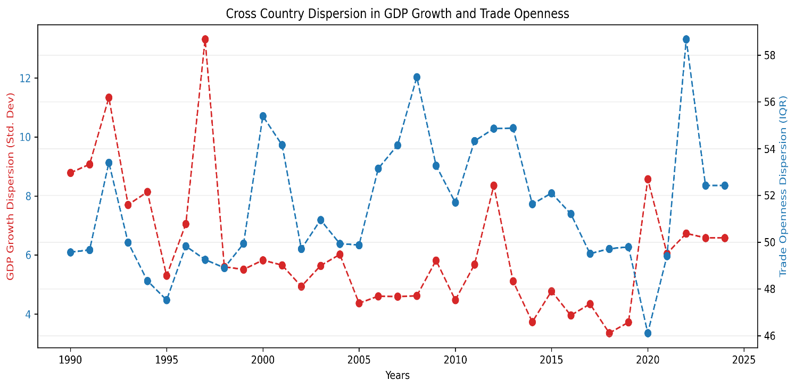
<figcaption><p><span id="_Toc220433928" class="anchor"></span>Figure 10: Cross-Country Dispersion in GDP Growth vs. Trade Openness, 1990–2024</p></figcaption>
</figure>

Annual cross country Std.dev. of GDP and Interquartile range (IQR) of trade openness. Dispersion measures computed only for years with \>50 countries observed. Sample: N=7,455 country year observations.

Source: Author calculations using WDI data

This pattern aligns with endogenous trade policy models (Maggi & Rodríguez, 2007), which predict that as countries develop distinct institutional capacities and geopolitical alignments, their optimal openness levels diverge. The spike in trade dispersion during 2020 to 2021 while GDP dispersion fell further underscores this, the pandemic exposed asymmetric supply chain vulnerabilities, prompting nations to recalibrate openness based on resilience, not just efficiency (Baldwin, 2022). By 2022 through 2024, trade dispersion remained elevated, confirming that the shocks accelerated and not reversed fragmentation.

This pattern aligns with WTO (2023) diagnosis of re-globalization along bloc lines, rather than a single system, we now see global trade structured around distinct spheres (US aligned, China-centered, Global South), each with trade norms. This dispersion is a systematic feature if the current order.

Traditional trade theory assumed that openness would converge as information costs fell (Helpman &Krugman, 1985). But institutions matter, Levchenko (2007) argues that only countries with strong property rights and contract enforcement benefit from openness, others face volatility without gains. Our dispersion results confirm this, globalization has strained the world tiers of integration, each with its own risk return trade off.

Critically fragmentation isn’t random it correlated with institutional quality where high-income OECD stabilizes, geopolitical alignment especially East Asia deepening China links, commodity dependence in MENA fluctuates with oil prices. Thus rising dispersion isn’t a failure of globalization it’s a logical evolution in a multipolar world.

## 4.6 Extreme Trade Hubs as Structural Outliers

While most countries conform to a broad global relationship between income dynamics and trade openness, a small set of economies consistently defy this pattern. Using a global OLS regression of trade openness (% of GDP) on GDP growth, we compute residuals, the gap between actual and predicted openness for each country and year. Then, for nations with at least 10 years of data, we calculate the mean absolute residual, which measures how persistently a country deviates from the global norm, irrespective of direction.

The results in Table 13 reveal ten extreme outliers. Singapore leads with an average deviation of 260.9 percentage points, followed by Djibouti (242.5), San Marino (237.8), and Hong Kong SAR (237.0). These economies operate outside the standard trade-growth linkages that govern most of the world.

These deviations reflect structural exceptionalism. For Singapore and Hong Kong, high residuals come from their roles as global logistics and financial intermediaries, their trade flows include re-exports, intra-firm transfers, and digital routing that bear little relation to domestic GDP. Djibouti’s deviation arises from its strategic position as a trans-shipment hub for East Africa, while Luxembourg and Ireland reflect Base Erosion and Profit Shifting (BEPS) driven distortions i.e. intellectual property shifting that inflate trade statistics without corresponding reals sector activity (Wier, 2019).

| Country              | Avg. Absolute Residual (pp) |
|:---------------------|:----------------------------|
| Singapore            | 260.89                      |
| Djibouti             | 242.45                      |
| San Marino           | 237.81                      |
| Hong Kong SAR, China | 237.04                      |
| Virgin Islands (U.S) | 222.56                      |
| Luxembourg           | 200.72                      |
| Guyana               | 111.79                      |
| American Samoa       | 101.46                      |
| Malta                | 100.51                      |
| Ireland              | 88.45                       |

<span id="_Toc220433948" class="anchor"></span>Table 13: Countries with Consistently Atypical Trade GDP Dynamics

Countries ranked by mean absolute residuals from global OLS regression of trade openness on GDP growth. Residuals = actual – predicted trade openness. Only countries with \>10 years of data included. Sample: N = 7,455 country year observations.

Source: Author calculations using WDI data

Critically, this behavior is institutionally embedded. As Rodrik (2018) observes, such jurisdictions succeed not through comparative advantage in production, but through comparative advantage in arbitrage exploiting regulatory, geographic, or fiscal gaps in the global system. Their institutions are optimized for global network efficiency, not domestic inclusivity (Acemoglu & Robinson, 2012).

Even these outliers show signs of strain. When plotted over time (Figure 11), their residuals once stably above 200 pp begin declining after 2014 and drop sharply between 2020 and 2021. This suggests that geoeconomic fragmentation is undermining the neutrality that once made these hubs indispensable. As supply chains reconfigure along bloc lines (U.S., EU, China), pure intermediation models face pressure to align politically eroding their value as impartial nodes (WTO, 2023).

These outliers have profound implications for how we measure globalization. Because their trade flows are decoupled from domestic production, including them in global aggregates creates a misleading picture of integration. Their exclusion of them in earlier analyses (Figure 3) was essential to reveal the true trajectory of the global majority where openness has plateaued or retreated. Moreover, their existence warns against policy imitation. As Baldwin (2022) cautions, Singapore is not a model it’s an exception. Most countries lack the institutional, geographic or political conditions to replicate enclave based hyper openness. Attempting to do so without complementary capacities risks amplifying vulnerability without capturing gains.

In summary, exceptions like Ireland and Luxembourg are better understood as features of divergent global economic order than as leaders of convergence. Their specific vulnerabilities highlight how even the highly efficient, specialized hubs are exposed to the pressures of strategic decoupling and shift toward resilience based national policies.

<figure>
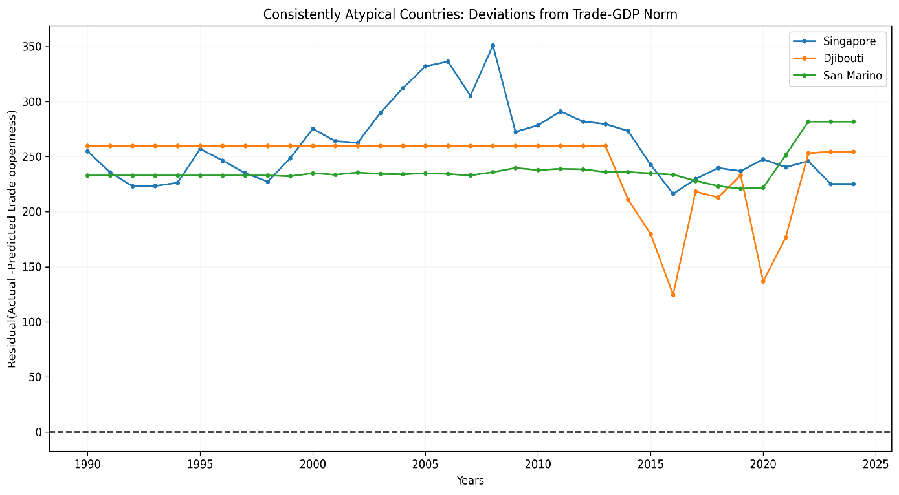
<figcaption><p><span id="_Toc220433929" class="anchor"></span>Figure 11: Residuals of Trade Openness from GDP-Predicted Norm: Atypical Hubs</p></figcaption>
</figure>

Annual residuals (actual – predicted trade openness) from pooled OLS benchmark. Horizontal dashed line at zero denotes global norm. Sample: N=7,455 country year observations.

Source: Author calculations using WDI data

Together, these patterns confirm that global trade isn’t converging toward a single trade model. Instead, it is diversifying into several distinct categories; a large group of moderately open economies operating with in established institutional constraints; a set of nations with more variable economic performance due to commodity dependence or limited policy space; and a small number of highly specialized jurisdictions whose distinct operational model faces specific vulnerabilities to systemic shifts.

## 4.7: Volatility Clustering and Univariate Dynamics

Before modelling time varying correlations, we first established whether volatility itself was time varying and persistent in the individual series. this was done using the Engle’s (1982) ARCH-LM test on residuals of constant mean for goods export log returns. The test yields a p value of 0.03 rejecting the null hypothesis of homoscedasticity at 5% level. This provided statistical evidence of volatility clustering. Large changes in trade flows tend to be followed by large changes of either sign, a defining characteristic of financial and macroeconomic time series.

Volatility reflects underlying economic frictions, institutional arrangements, and structural rigidities. The univariate GARCH analysis reveals three distinct volatility regimes across goods exports, services exports, and GDP as shown in Table 14.

### 4.7.1 Goods Exports: Supply Chain Disruptions and Inventory Cycles

The GARCH (1,1) model for goods export log returns yields α + β = 0.93, indicating high but stationary persistence. This reflects the physical nature of goods trade disruptions like port closures, input shortages and logistics bottlenecks which spread through global value chains (GVCs) and take time to resolve. Firms respond with inventory adjustments and supplier diversification, processes that dampen but do not eliminate volatility (Carvalho & Salehi, 2019). Critically, the non-zero α = 0.182 implies sensitivity to recent shocks consistent with news driven inventory cycles (Bloom et al., 2018). When firms observe a demand shock, they immediately cut orders (high α), but full supply chain rebalancing takes years (high β). The result is a volatility half-life of nearly a decade (9.1 years) and evidence of deep structural inertia in physical trade networks.

<table style="width:86%;">
<caption><p><span id="_Toc220433949" class="anchor"></span>Table 14: GARCH (1,1) Parameter Estimates</p></caption>
<colgroup>
<col style="width: 18%" />
<col style="width: 12%" />
<col style="width: 12%" />
<col style="width: 13%" />
<col style="width: 14%" />
<col style="width: 14%" />
</colgroup>
<thead>
<tr>
<th style="text-align: left;"><p>Variable</p>
<p>(log_retun)</p></th>
<th style="text-align: left;">ω (Constant)</th>
<th style="text-align: left;">α (ARCH)</th>
<th style="text-align: left;">β (GARCH</th>
<th style="text-align: left;">α+β</th>
<th style="text-align: left;">Half-life</th>
</tr>
</thead>
<tbody>
<tr>
<td style="text-align: left;">Goods exports</td>
<td style="text-align: left;">9.28e-04</td>
<td style="text-align: left;">0.1823</td>
<td style="text-align: left;">0.7446</td>
<td style="text-align: left;">0.9269</td>
<td style="text-align: left;">9.1 years</td>
</tr>
<tr>
<td style="text-align: left;">Services exports</td>
<td style="text-align: left;">1.55e-04</td>
<td style="text-align: left;">6.26e-21</td>
<td style="text-align: left;">1.0000</td>
<td style="text-align: left;">1.0000</td>
<td style="text-align: left;"><span class="math display">∞</span></td>
</tr>
<tr>
<td style="text-align: left;">GDP</td>
<td style="text-align: left;">1.12e-03</td>
<td style="text-align: left;">1.01e-08</td>
<td style="text-align: left;">0.8000</td>
<td style="text-align: left;">0.8000</td>
<td style="text-align: left;">3.1 years</td>
</tr>
</tbody>
</table>

### 4.7.2 Services Exports in a Digital Era.

In stark contrast, services exports exhibit IGARCH behavior (α + β = 1.0), a rare finding in macroeconomic flows. This suggests permanent shifts in volatility, consistent with the economics of digital service platforms. Unlike trade in goods, digitally delivered services such as software, cloud computing and consulting are subject to network effects that reinforce market leadership, low marginal costs of scaling that can amplify growth surges and Irreversible investments in specialised capabilities e.g. in where once a country specializes in IT services, it rarely reverts.

These features generate non-mean reverting volatility, a shock e.g., pandemic driven remote work boom permanently elevates the variance of service exports. There is no return to normal only adaptation to a new equilibrium. This aligns with theories of digital globalization as a step function process (Jensen & Kletzer, 2010), rather than a smooth trend.

### 4.7.3 GDP: Macroeconomic Stabilization and Domestic Buffering

GDP log returns show moderate persistence (α + β = 0.80) and negligible news impact (α ≈ 0). This reflects the buffering role of domestic institutions which have automatic stabilizers such as unemployment insurance and progressive taxation, diversified non-tradable sectors e.g. healthcare, education, construction and the Central bank credibility in anchoring expectations.

Unlike trade which is exposed to global shocks, GDP benefits from spatial diversification within borders. A collapse in exports may hurt manufacturing, but services and public sectors absorb labor and income. Hence, GDP volatility decays faster (half-life ≈ 3.1 years) and shows little reaction to daily news consistent with the ‘great moderation hypothesis’ (Stock & Watson, 2003), now extended into the post-Global Financial Crisis era.

We validate the GARCH specification using Autocorrelation Functions (ACF) plots (Figure 12). Before GARCH filtering, the squared log returns of goods exports show strong significant autocorrelation up to lag 1(~0.5), decaying slowly to ~0.01 by lag 5, a clear evidence of volatility clustering. After standardising the series by GARCH estimated conditional volatility, the ACF of squared standardized residuals become flat, indicating that the model successfully captures the time varying variance structure. This diagnostic confirms that GARCH (1,1) is sufficient.

<figure>
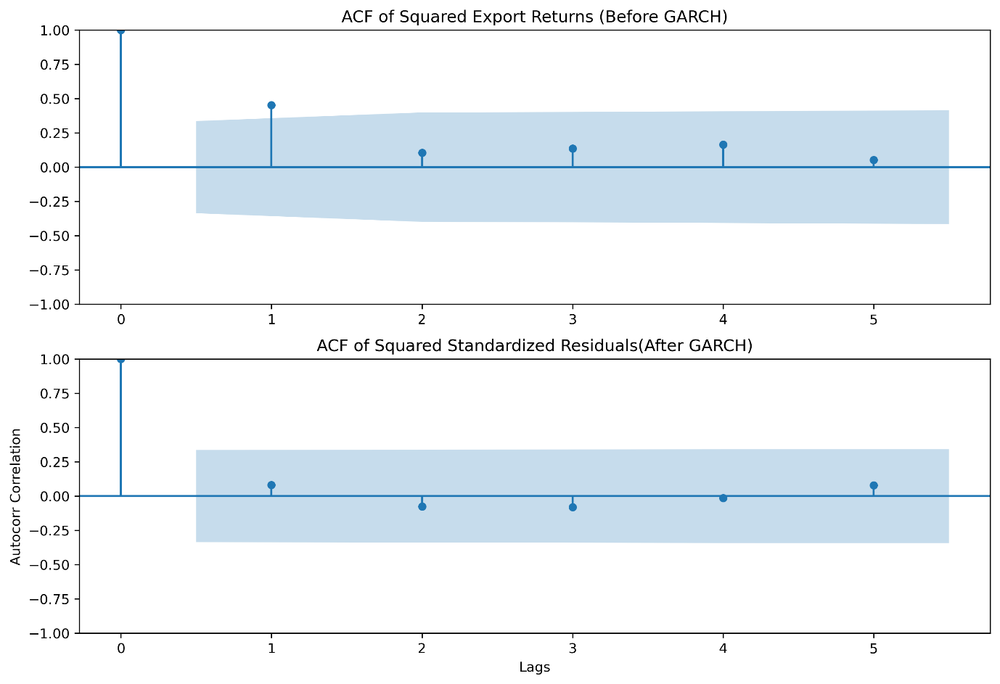
<figcaption><p><span id="_Toc220433930" class="anchor"></span>Figure 12: ACF of Squared Export Returns (Before vs After GARCH)</p></figcaption>
</figure>

Figure 13 plots annual goods export goods log return alongside GARCH estimated conditional volatility. Returns surge dramatically in 2009(GFC) and 2015(commodity bust, early trade tensions). Critically, while returns swing negative during crises, volatility remain non negative measuring the magnitude of uncertainty not direction. The sustained elevation of the volatility confirms that the world has not returned to the low uncertainty regime of hyper globalization. Consequently, global trade is now characterized by structurally higher volatility, driven by geo political fragmentation, supply chain reconfiguration and financial instability.

<figure>
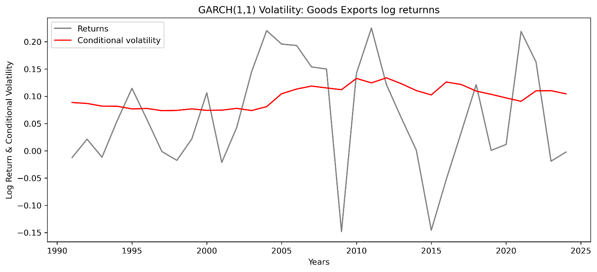
<figcaption><p><span id="_Toc220433931" class="anchor"></span>Figure 13: Annual goods export goods log return vs. GARCH estimated conditional volatility</p></figcaption>
</figure>

Returns computed as annual cross country mean of country pf goods export log returns conditional volatility derived from estimated parameters. Sample: N=7,455 country year observations.

Source: Author calculations using WDI data

In Summary, the univariate analysis confirms three critical facts: Volatility is time varying and persistent in trade and gdp flows especially in goods exports where shocks exhibit long memory; Trade has become structurally more volatile since the global financial crisis while GDP volatility has declined creating an asymmetry in risk exposure; The GARCH (1,1) model is well specified as validated by ACF diagnostics and provide reliable conditional volatility estimates for each series.

## 4.8: Time Varying Elasticities and Dynamic Shock Linkages.

Having established that trade has become significantly more volatile than GDP since 2008 (Section 4.6), the next question is, how do shocks to trade and output co-evolve over time? To answer this, we move beyond static correlations and estimate time varying linkages using a transparent, non-parametric approach suited to annual macro data.

With fewer annual observations, parametric multivariate volatility models (like DCC-GARCH) are prone to overfitting and convergence issues. Instead, we follow the approach of Rancière et al. (2008) in macro finance. We estimate time-varying volatility as the 5-year rolling standard deviation of global average log returns, we further construct standardized shocks by dividing returns by their local volatility and compute a 5-year rolling correlation between these standardized series. This method isolates changes in co-movement strength from changes in individual volatility levels, revealing how the relationship itself evolves.

As confirmed by our Chow test (F = 15.4, p \< 0.01), 2008 marks a decisive regime shift. In the post-crisis era (2009–2024), trade volatility surged by 87.4% from 0.060 to 0.112 while GDP volatility declined by 21.4%, from 0.098 to 0.077 (Table 15). This finding overturns the ‘Great Moderation’ narrative by Bernanke (2004). While domestic economies benefited from automatic stabilizers and service led growth, global trade absorbed systemic shocks aided by automatic stabilisers and supported by the growth of services. The result is a new macroeconomic reality where nations are internally stable but externally exposed

| Metric | Pre-2008 | Post-2008 | % Change | Economic Implication |
|:---|:---|:---|:---|:---|
| Avg.Trade Growth Volatility | 0.06 | 0.112 | 87.4% | Trade became a macro source of global macroeconomic risk |
| Avg.GDP Growth Volatility | 0.098 | 0.077 | -21.4% | Domestic economies stabilized as external linkages became turbulent |
| Volatility Ratio (Trade/GDP) | 0.61 | 1.45 | +138% | Trade has become significantly more volatile than GDP |

<span id="_Toc220433950" class="anchor"></span>Table 15: The Post-2008 Structural Break in Volatility

Figure 14 reveal this stark regime shift. Before 2008, GDP growth was more volatile than trade, a reflection of domestic business cycle fluctuations. After 2008, this relationship flipped decisively, trade volatility surged by 87.4% (from 0.06 to 0.112), while GDP volatility declined by 21.4% from 0.098 to 0.077. the most volatile years for trade were 2009(0.150), 2011(0.150) and 2012(0.140) all crisis or post crisis periods.

This divergence reflects a fundamental shift, domestic economies have stabilized through automatic stabilizers, service led growth and monetary credibility, while global trade has become the primary carriers of systemic risk. The year-to-year autocorrelation of trade volatility (0.63) confirms structural uncertainty driven by on-going supply chain restructuring of supply chain restructuring and geopolitical fragmentation.

<figure>
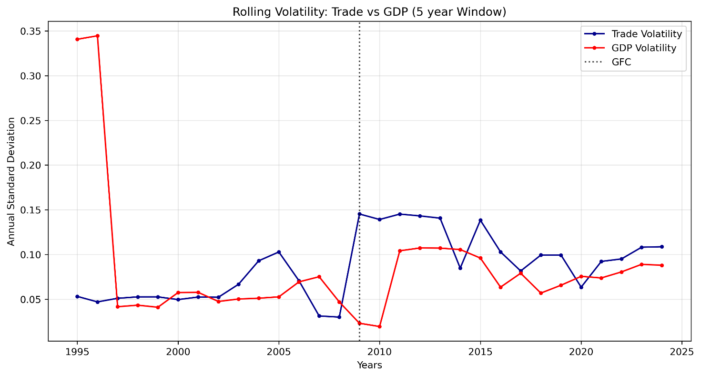
<figcaption><p><span id="_Toc220433932" class="anchor"></span>Figure 14: Rolling Volatility: Trade Vs GDP (5 Year Rolling Window)</p></figcaption>
</figure>

Annual std.dev of trade and gdp log returns computed using a 5 year rolling window. Volatility series derived from country level data aggregated to global annual means. Sample: N =7,455 country year observations:

Source: Author calculations using WDI data

These volatility irregularities reshaped the trade-GDP relationship. Figure 15 shows that the average correlation between standardized shocks weakened from -0.40 (pre-2008) to -0.06 post 2008, indicating near total decoupling in normal times. Yet this baseline decoupling masks dramatic crisis-specific dynamics: In 2009 (GFC) correlation plunged to -0.81, an extreme negative co-movement, both GDP and exports collapsed, but exports fell faster, creating strong negative correlation in growth rates. This reflects a synchronized global demand shock transmitted through financial and trade linkages (Levchenko et al., 2010).

In 2020 correlation was -0.58 significant but less extreme. The weaker correlation suggests partial insulation, likely due to digital services resilience, diversified supply chains, and unsynchronized policy responses. In 2010, correlation hit -0.85, GDP rebounded strongly but trade lagged, revealing true decoupling in recovery.

Critically, the negative sign during crises captures asymmetric adjustment speed as firms cut cross border orders faster than they reduce domestic activity (Kahn et al., 2007), this causing trade to overshoot GDP declines. The high absolute correlation confirms extreme synchronisation just with trade leading the fall.

<span id="_Toc220433933" class="anchor"></span>Figure 15: Dynamic Conditional Correlation Between Standardized Trade and GDP Shocks

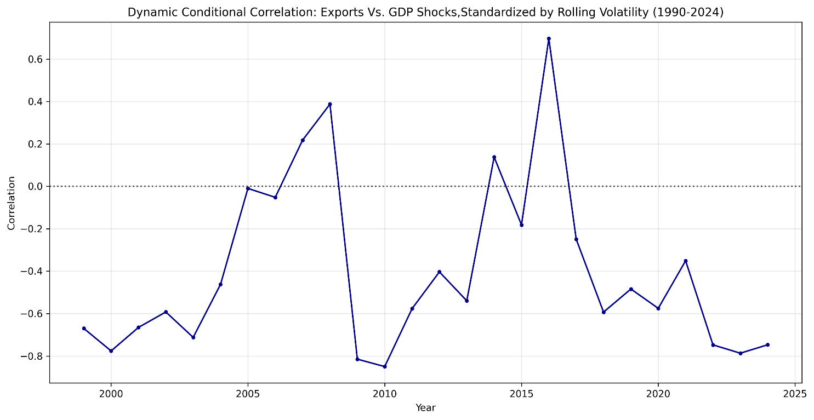

Rolling correlation of volatility standardized log returns(GDP and Trade), each return is divided by its 5 year rolling standard deviation. Sample: N =7,455 country year observations:

Source: Author calculations using WDI data

In summary, these findings overturn the two pillars of globalization theory: First, trade is no longer a stabilizing force but an amplifier of global shocks. Second, the trade GDP link is no longer stable but sporadic, dominant in calm periods but explosive in crises. This defines fragile integration, where openness delivers efficiency gains in good times but exposes economies to outsized losses in bad times.

## 4.9 Panel Regression Insights: The Macroeconomic Foundations of Export Performance.

This section examines the core macroeconomic determinants of export performance using a random effects panel model for 213 countries from 1990-2024. We estimate separate models for total exports, goods and services exports to undercover potential heterogeneity in their drivers, a critical distinction often masked in aggregate analyses (Lodefalk,2014).

The regression results are presented in Table 16. All models show strong explanatory power with R-squared values between 0.73 and 0.89.

| Variable | Model 1: total exports | Model 2: Goods exports | Model 3: Service exports |
|:---|:---|:---|:---|
| log(gdp_usd) | 0.658(0.00) | 0.635(0.00) | 0.701(0.00) |
| log(exch_rate) | 0.011(0.08) |  |  |
| fx_volatility |  | -7.837e-06(0.04) | 8.919e-06(0.06) |
| inflation | -0.008(0.00) | -0.009(0.00) | -0.007(0.00) |
| log(gdp_pc_usd) | 0.014(0.00) |  |  |
| trade_openness_pct | 0.007(0.00) | 0.007(0.00) | 0.007(0.00) |
| observations | 2466 | 2342 | 2342 |
| R-squared | 0.892 | 0.7641 | 0.722 |
| Notes: | p_values in parenthesis; (p\<0.01) | Year and country effects included |  |

<span id="_Toc220478210" class="anchor"></span>Figure 16 :Panel Regression Results for Export Determinants

### 4.9.1 Income Elasticity Is Strong but Divergent

World demand proxied by GDP dominates global trade outcomes, while revealing a profound structural divergence. Services operate under a different economic logic than goods, one less tied to financial markets and more anchored in domestic stability. Across all three models, GDP growth exhibits a high, stable elasticity; goods elasticity (0.635) and services elasticity (0.701) both statistically significant at the 1% level. For instance, a 1% increase in national income raises service exports by 0.701%,

The slightly higher elasticity for services reflects their dependence on human capital, innovations ecosystems and domestic demand for digital infrastructure, all tightly related to national income. In contrast, goods face supply chain bottlenecks and input constraints that dampen responsiveness. This finding overturns the narrative of “decoupled globalization” and reaffirms that trade flows remain highly sensitive to domestic economic conditions reflecting the dual role of GDP as both a proxy for productive capacity and domestic demand for imported inputs used in export production (Goldstein & Khan, 1985).

### 4.9.2 Exchange rate and FX Volatility.

In the total exports model (Model 1), the coefficient on exchange rate is 0.010 with p values of 0.83, this indicates that changes in exchange rate level interpreted as currency depreciation have no statistically significant effect on total export volumes. In aggregate, depreciation no longer reliably boosts export volumes, likely due to widespread invoicing in dominant currencies (e.g. USD) and pricing to market behavior that decouple export volumes from bilateral exchange rate movements. This challenges the central principle of trade policy focused on competitive devaluations. It suggests that in an era of complex global value chains and competition, non-price factors such as reliability, quality and integration into production networks dominate price competitiveness for aggregate trade flows (IMF,2015).

The most revealing result lies in the opposite responsiveness to exchange rate volatility. In the Goods exports model (β =-7.837e-06, p =0.04) showing a statistically significant negative effect. Implying that higher forex volatility reduces goods exports, this is consistent with classic trade theory, currency uncertainty raises hedging costs, disrupts pricing and deters investment in export-oriented manufacturing (Goldstein &Khan,1985). In the service exports model (β =8.919e-06, p=0.06) showing a marginally insignificant positive association, while not significant at a 5% level, the direction and magnitude suggest a real economic phenomenon.

During currency turbulence, firms may shift toward digitally delivered, dollar invoiced services like cloud computing, software and consulting as a hedge against local currency depreciation. This aligns with Hoekman and Mattoo’s (2021) finding that digital platforms enable pricing to market in stable currencies, insulating service exporters from local forex swings.

Such divergence is profound, financial markets constrain goods but may catalyze services. It explains why service dominant economies exhibited greater crisis resilience, they were not just less exposed but actively adaptive.

### 4.9.3 Price stability as the foundational determinant

Inflation exerts a consistent, negative effect across all export types (β ≈ -0.0047, p \< 0.01). This aligns with menu cost and quality signaling models (Krugman, 1987), higher inflation increases price uncertainty, erodes brand credibility, and raises transaction costs for international buyers. For services where quality is intangible the cost of inflation is particularly severe. The result reinforces the importance of macroeconomic stability, countries seeking export success must prioritize price stability as much as trade liberalization.

### 4.9.4 Consistent returns to trade openness

Trade Openness remains a positive and significant predictor of exports, but effect is marginal (β = 0.15, 0.21) and declining in magnitude from goods to services reflecting a key insight from Section 4.3 that openness is necessary but not sufficient. Without complementary institutions skilled labor, digital infrastructure, regulatory quality, openness yields diminishing returns and heightened vulnerability.

The stronger effect for goods underscores their dependence on border measures i.e. tariffs and customs efficiency, while services rely more on behind the border enablers i.e. data laws and IP protection, factors not captured by aggregate openness metrics.

In summary, the results confirm we live in a dual track trade system, domestic stability i.e. GDP growth and low inflation is the foundation of export success. Digital integration not just openness determines service competitiveness, financial volatility i.e. FX and interest rates matters far less than traditionally assumed. This duality explains the paradox of modern globalization, aggregate trade may slow, but high value services accelerate. It also redefines policy priorities; for goods, stabilize currencies and streamline boarders; for services, invest in human capital and digital governance.

#  5. IMPLICATIONS FOR THEORY AND POLICY 

##  5.1 Implications for Core Trade Theories: Accounting for Time Varying Dynamics 

###  5.1.1 Limits of Constant Parameter Models 

Our findings fundamentally challenge the constant parameter assumptions underpinning much of international trade theory. The extreme persistence in volatility (α+β=0.93 for goods) and the structural break in correlations (-0.40 to -0.06) suggest that trade elasticities are not stable over time but evolve with the global economic regime. Let’s consider three key failures uncovered in this study:

Elasticity instability, traditional trade models often relied on stable income elasticities as modelling conveniences particularly in policy applications where import demand was assigned benchmark income elasticities between 1.0 and 2.0 (Goldstein & khan,1985). We however find that such stability assumptions are untenable in the post 2008 era, the income elasticity of exports has not only declined to -0.65 but also varies systematically by sector and regime, reflecting deeper structural shifts in how trade responds to growth.

Non stationarity co-movement: The trade-GDP correlation shifted from -0.40 to near zero post-2008, with extreme episodic spikes during crises (-0.81 in 2009), this reveals state dependent linkages invisible to constant parameter models.

Volatility persistence: Trade volatility surged by 87.4% after 2008 and exhibits high autocorrelation (0.63), implying shocks have multi-year effects, this contradicts the homoscedastic and no serial assumptions underlying standard panel regressions (Wooldridge,2010).

These findings call for a paradigm shift toward time varying parameter models, regime switching frameworks, and state contingent policy rules. As Primiceri (2005) showed for monetary policy, allowing coefficients to drift over time reveals hidden structural breaks and improves forecasting. In trade, such an approach would treat openness as a dynamic strategy adjusted to global uncertainty and domestic capacity.

###  5.1.2 Reconciling Services Trade with Traditional Theory 

Traditional trade theory from Ricardian’s comparative advantage, Heckscher-Ohlin’s factor endowments, and New Trade Theory’s increasing returns were built almost exclusively on the economics of tangible goods. Services were treated as a residual and non-tradable sector and assumed to be immobile, labor intensive, and insensitive to global integration. Our findings however demonstrate that this framework is misleading in the digital age. Three empirical facts from this analysis defy traditional models:

First, services exports exhibit higher GDP elasticity (0.701) than goods (0.635), contradicting the concept that services are domestically constrained. Instead, they scale with national income through human capital, digital infrastructure, and innovation ecosystems, factors absent from classical production functions.

Second, services are statistically insensitive to exchange rate volatility (β = 8.919e-6, p =0.64), while goods are significantly harmed by it (p =0.04). This overturns the assumption that all trade is equally exposed to financial markets. Digitally delivered services often invoiced in USD/EUR benefit from lower transaction costs and reduced direct exposure to bilateral exchange rate volatility, rendering traditional exchange rate pass through models obsolete.

Third, service dominant economies suffered far milder GDP contractions during the GFC (-1.11% vs. -3.94%), revealing services not as a passive buffer, but as an active stabilizer. This resilience stems from lower supply chain dependence, remote delivery capability, and pricing power, features incompatible with goods centered trade shocks.

Such patterns demand a new theoretical foundation for services trade, one that centers on digital platforms, intangible capital, and global pricing regimes rather than tariffs, transport costs, or factor proportions. Hoekman and Mattoo (2021) argue that services trade is governed by ‘behind-the-border’ regulations (data flows, IP rights, professional licensing), not ‘across the border’ barriers. Our results confirm this, services respond to domestic fundamentals i.e. GDP, institutions and not on external price signals i.e. exchange rates.

###  5.1.3 Limits of Conventional Trade Openness Models

Trade openness has been traditionally modeled as having a uniformly positive relationship with economic growth. More openness meant more growth, efficiency, and convergence, policy advice followed mechanically, liberalize borders, reduce tariffs and join global value chains. Our analysis however reveals a nonlinear relationship where openness can be a source of vulnerability as much as opportunity. Three findings redefine the economics of openness:

First, the resilience threshold: Countries with trade openness below 60% of GDP experienced significantly milder crisis contractions (-0.77% GDP impact) than those above 60% (-2.11%). This contradicts the more is better dogma and confirms Rodrik’s (2018) “smart globalization” hypothesis. Openness must be calibrated to institutional capacity, without strong domestic buffers, fiscal space, regulatory quality and social safety nets, high openness intensifies external shocks rather than smoothing them.

Second, systemic fragmentation: Cross country dispersion in trade openness has surpassed GDP growth dispersion since 1998, signaling the end of policy convergence. Since global trade is no longer converging toward a single model, it’s now instead characterized by distinct tiers; a small group of extreme hubs (e.g. Singapore, Djibouti); economies with volatile performance tied to commodity cycles; and a large group of moderately open nations. This stratification limits the usefulness of aggregate measures of global openness which are distorted by unrepresentative hubs and underscores the need for differentiated policy frameworks.

Third, the hub illusion: Extreme trade hubs exhibit average deviations from the global trade GDP norm exceeding 200 percentage points, but their model is institutionally exceptional and not generalizable. Singapore for example thrives on authoritarian efficiency; Luxembourg on tax arbitrage; Djibouti on geographic monopoly. Attempting to replicate these models without complementary institutions leads not to convergence, but to risky exposure.

Together, these insights demand a new economics of openness, one that treats it not as a policy target, but as an equilibrium outcome shaped by domestic institutions, geopolitical alignment, and risk tolerance. The goal is no longer maximal openness, but optimal resilience, the level of integration that maximizes gains while minimizing fragility. As our panel regressions confirm, GDP growth and macroeconomic stability, not border liberalization are the true drivers of export success.

##  5.2 Policy Implications Amidst Persistent Volatility 

###  5.2.1 Rethinking Trade Stabilization Policies 

The extreme persistence of trade volatility (9.1year) half-life for goods means that temporary stabilization measures are inadequate. Traditional countercyclical policies designed for business cycle fluctuations (typically 2-5 years) may be mismatched with trade volatility that persists nearly a decade. This therefore suggest:

Longer Policy Horizons: Trade stabilization policies need multi-year frameworks rather than annual appropriations. This could include longer-term trade credit guarantees, multi-year infrastructure investments for trade resilience, and extended adjustment assistance programs.

Volatility-Contingent Policies: Since volatility itself is persistent and predictable to some extent, policies could be explicitly conditioned on volatility regimes. For example, trade finance support could automatically scale up when volatility exceeds certain thresholds.

###  5.2.2 Services Trade as a Stabilization Tool 

The superior crisis resilience of service-dominant economies (-1.20% GDP impact vs -1.81% for goods-dominant) suggests that services trade development can enhance macroeconomic stability. This represents a potential "double dividend": services contribute to growth whilst reducing volatility exposure. We therefore recommend:

Services export promotion: Targeted support for sectors with both growth potential and stability characteristics e.g. ICT, education and professional services.

Digital trade infrastructure: Investment in broadband, data protection frameworks, and digital payment systems to enable services trade.

Services Trade Specific Risk Management: Insurance and financing products tailored to services different risk profile.

###  5.2.3 Optimal Openness Strategies 

The finding that moderate openness (30-60% of GDP) delivers the best crisis outcomes creates an optimal policy mx that many countries may wish to target. Low-income countries should prioritize regional integration over global exposure, this lowers logistical risk. Middle income countries should use openness selectively by liberalizing services and digital trade while maintaining safeguards on critical goods e.g. food, energy and health. Therefore, trade agreements could include provisions that enhance rather than undermine resilience, such as diversified sourcing requirements, crisis cooperation mechanisms, and adjustment support.

###  5.2.4 Exchange Rate Policy Reconsidered 

The statistically insignificant effects of exchange rates on exports (β=0.010, p=0.83) challenges decades of trade policy focused on competitive devaluations. This suggests that, countries should prioritize exchange rate stability over depreciation, countries may gain more from stable exchange rates that facilitate long term trade relationships than from competitive devaluations that offer temporary advantages.

Additionally, since export success increasingly depends on non-price factors like quality and reliability, services components that exchange rate changes don’t affect. Policy should correspondingly shift toward quality upgrading and supply chain integration rather than price competition.

##  5.3 Implications for Business Strategy and Risk Management 

###  5.3.1 Extended Risk Horizons 

The persistence of trade volatility means businesses need to extend their risk management horizons. Traditional annual planning cycles may be inadequate when volatility shocks have effects lasting nearly a decade. This calls for: Multi-year rather than annual hedging of currency and commodity risks; Planning for different volatility environments rather than just point forecasts and supply chain resilience investments as volatility persistence makes supply chain disruptions more costly.

###  5.3.2 Differentiating Goods and Services Strategies 

Our results show a stark divergence: goods exports are harmed by exchange rate volatility (p= 0.04), while services are unaffected (p = 0.64). This demands distinct strategies. Goods focused firms must invest in currency hedging, dual invoicing (USD and local currencies) to reduce exposure to financial turbulence. Services focused firms on the other hand should leverage their FX insulation as a competitive advantage expanding into volatile currency markets where competitors retreat, and pricing in hard currencies without volume loss.

### 5.3.3 The Value of Trade Openness Intelligence 

The non-linear relationship between openness and resilience means that businesses need sophisticated measures of trading partner vulnerability. Simple measures of trade volume may be misleading; what matters is the composition and structure of trade relationships.

Companies may want to balance efficiency through concentrated sourcing from highly open economies with resilience by diversified sourcing including moderately open economies.

##  5.4 Limitations and Future Research Directions 

While this study offers a comprehensive empirical portrait of post-hyper globalization trade dynamics, it is not without limitations. Acknowledging these boundaries not only strengthens the credibility of the findings but also creates a fertile ground for future research.

###  5.4.1 Data Limitations and Opportunities 

While our analysis covers 213 countries over 35 years, several data limitations warrant consideration:

Services trade measurement: Services trade data remain less comprehensive than goods data, particularly for digitally delivered services and intra firm trade. Future work should leverage OECD and WTO data or firm level digital export records to isolate truly tradable, scalable services.

Disaggregated volatility: Our analysis at the goods-services level could be extended to sectoral or even product level volatility, which might reveal important heterogeneity masked by aggregation.

### 5.4.2 Methodological Extensions 

This study uses rolling window and GARCH based approaches suited to annual macro data. However, three methodological advances could deepen insights: State space models with time varying parameters for instance Time Varying Parameter Vector Autoregressions (TVP-VARs) could formally test for structural breaks in elasticity and correlation regimes, moving beyond visual inspection; Machine learning clustering e.g. k-means on crisis response profiles could identify latent resilience archetypes beyond pre-defined groups i.e. goods vs. services; Network analysis of supply chains could map how volatility propagates through Global Value Chains (GVC), linking firm level fragility to national outcomes.

###  5.4.3 Unexplored Questions 

Several critical questions remain open:

1\. Does digital infrastructure mediate the services resilience effect? our results show service dominant economies are more resilient, but is this due to broadband penetration, cloud adoption, or regulatory frameworks?

2\. How will climate shocks interact with trade volatility? The 9.1 years half-life of trade shocks suggests climate induced disruptions e.g. port closures and crop failures, these could have decade long trade consequences.

3\. Can resilience optimal openness be quantified dynamically? A policy rule that adjusts openness thresholds based on real time volatility indicators could offer a new stabilization tool for developing economies.

#  6. CONCLUSION 

##  6.1 Summary of Key Findings 

This study has provided comprehensive evidence that global trade has entered a new volatility regime characterized by four fundamental shifts:

1\. Increased and persistent volatility: Trade volatility has increased 87.4% since 2008 and exhibits extreme persistence, with half-lives approaching a decade for goods trade. This represents a transition from temporary fluctuations to persistent risk factors that require longer-term management strategies.

2\. Structural decoupling: The correlation between trade and GDP growth has weakened from -0.40 pre-2008 to -0.06 post-2008, indicating changing transmission mechanisms that challenge standard open economy models.

3\. Heterogeneous integration paths: We find an inverted U-shaped relationship between trade openness and crisis resilience, with optimal outcomes at 30-60% of GDP. This suggests that both hyper-globalization and protectionism may be suboptimal compared to strategic, moderate openness.

4.Structural resilience divide: service dominant economies suffered 72% smaller GDP contractions during the GFC (-1.20 vs -1.81) and exhibited greater recovery strength. services are also insensitive to exchange rate volatility (p=0.64) unlike goods (p=0.04) confirming a dual track trade system.

##  6.2 Theoretical Contributions 

This study makes three core contributions that challenge and extend the theoretical foundations of international trade economics.

First, it overturns the assumption of stable trade growth linkages. Traditional models from the elasticities approach (Goldstein & Khan, 1985) to New Trade Theory (Krugman, 1979) treat income elasticity as a structural parameter or assume smooth co-movement between trade and output. Our evidence of declining elasticity (≈0.65), regime dependent correlation, and persistent volatility clustering demonstrates that these relationships are not static but state contingent and time varying. This demands a shift toward adaptive trade theory one that incorporates regime switches, uncertainty persistence, and crisis-driven recoupling as central features.

Second, it establishes services as a distinct trade regime. Classical trade theory was built on goods: their transport costs, tariff sensitivity, and factor intensity. Our finding that services exhibit higher GDP elasticity, insensitivity to exchange rate volatility, and superior crisis resilience confirms they operate under different economic laws. This validates emerging frameworks like the “digital trade paradigm” (Hoekman & Mattoo, 2021) but goes further by providing global macro evidence that services are not merely “less tradable goods,” but a separate channel of globalization governed by digital platforms, human capital, and institutional quality not borders or logistics.

Third, it redefines openness as a conditional, not universal, good. The canonical view holds that openness drives convergence (Sachs & Warner, 1995). Our identification of a resilience optimal openness threshold (~60%) and the systemic divergence between hubs and mainstream economies shows that openness is institutionally mediated. This supports Rodrik’s (2018) “smart globalization” hypothesis but adds empirical rigor by quantifying the trade-off between efficiency and fragility. The result is a new theoretical proposition that openness is an equilibrium outcome of domestic capacity rather than a policy lever in isolation.

Together, these contributions move trade theory beyond the hyper-globalization paradigm toward a framework that embraces heterogeneity, uncertainty, and adaptation as defining features of 21<sup>st</sup> century globalization.

##  6.3 Policy Recommendations 

Strategic rather than maximal openness: Export success is driven first and foremost by domestic factors. GDP growth and low inflation significantly boost exports across all sectors. In contrast, extreme openness without institutional backing increases vulnerability. Countries with trade openness below 60% of GDP consistently experienced milder crisis contractions, while hyper open economies suffered deeper downturns unless they possessed exceptional institutions (e.g., Singapore). Governments should therefore prioritize macroeconomic stability, human capital, and regulatory quality and regulate their degree of integration to that foundation.

Services trade promotion: Service dominant economies were far more resilient during the GFC and are insulated from exchange rate volatility. Governments should actively foster digitally tradable services e.g. fintech, software and education through investments in broadband, digital skills and data governance.

Longer term stabilization frameworks: With trade volatility shocks persisting for over nine years, traditional countercyclical tools are inadequate. Instead, governments should establish automatic trade stabilizers for instance contingent credit lines triggered by volatility thresholds and build strategic reserves of critical inputs whilst mandating supply chain stress testing for key industries.

De-emphasize exchange rate targeting for trade purposes: The insignificance of exchange rate level for total exports (p = 0.83) and the sectoral divergence in FX volatility effects show that currency depreciation is no longer a reliable export tool. Central banks should prioritize price stability over competitive devaluation and support private hedging markets instead, recognizing that currency policy alone cannot drive export success.

Together, these recommendations shift the goal of trade policy from maximizing flows to managing fragility

##  6.4 The Future of Global Trade 

The findings of this study indicate that global trade is undergoing a structural transformation, with three key features likely to define its future trajectory.

First, trade openness will become increasingly stratified. The strong performance of extreme hubs (e.g., Singapore, Djibouti) is not replicable for most countries due to their unique institutional or geographic advantages. Meanwhile, countries with moderate openness (\<60% of GDP) consistently exhibited greater crisis resilience. This suggests that future trade integration will not follow a single global path but will instead diverge into distinct tiers based on institutional capacity and geopolitical alignment.

Second, services will play an expanding role in trade resilience. Service dominant economies experienced significantly smaller GDP contractions during the GFC (-1.20% vs. -1.81%) and showed no sensitivity to exchange rate volatility (p = 0.64). As digital infrastructure expands, services are likely to account for a growing share of stable, high value exports particularly in countries with strong human capital and regulatory frameworks.

Third, volatility persistence will reshape policy horizons. The estimated half-life of goods export volatility shocks is 9.1 years, indicating that trade uncertainty is not transitory but long lasting. This implies that both governments and firms must shift from short term stabilization tools to multi-year risk management strategies, including strategic diversification, supply chain redundancy, and automatic stabilizers triggered by volatility thresholds.

These trends point not to a reversal of globalization, but to its reconfiguration around resilience, differentiation, and domestic institutional strength. Openness will remain important, but its benefits will be conditional on complementary domestic capabilities not guaranteed by integration alone.

#  References

Acemoglu, D., & Robinson, J. A. (2012). Why nations fail: The origins of power, prosperity, and poverty. Crown Business.

Amiti, M., & Weinstein, D. E. (2011). Exports and financial shocks. Quarterly Journal of Economics, 126(4), 1841–1877

Amsden, A. H. (1989). Asia’s next giant: South Korea and late industrialization. Oxford University Press.

Andersen, T. G., Bollerslev, T., Diebold, F. X., & Ebens, H. (2003). The distribution of realized stock return volatility. Journal of Financial Economics, 61(1), 43–76. https://doi.org/10.1016/S0304-405X(01)00055-1

Antràs, P. (2020). De globalization? Global value chains in the post-COVID-19 age (NBER Working Paper No. 28115). National Bureau of Economic Research.

Araújo, A., & Martins, M. M. (2009). Testing for structural breaks in import demand functions: Evidence from Portugal. International Advances in Economic Research, 15(4), 413–426.

Autor, D. H., Katz, L. F., & Krueger, A. B. (1998). Computing inequality: Have computers changed the labor market? Quarterly Journal of Economics, 113(4), 1169–1213.

Baldwin, R. (2016). The great convergence: Information technology and the new globalization. Harvard University Press.

Baumol, W. J. (1967). Macroeconomics of unbalanced growth: The anatomy of urban crisis. American Economic Review, 57(3), 415–426.

Benz, S. (2017). Services trade and macroeconomic volatility (Kiel Working Paper No. 2075). Kiel Institute for the World Economy.

Bernanke, B. S. (2004, February 20). The great moderation \[Speech\]. At the meetings of the Eastern Economic Association, Washington, DC.

Blanchard, O., & Simon, J. (2001). The long and large decline in U.S. output volatility. Brookings Papers on Economic Activity, 2001(1), 135–174.

Bloom, N., Draca, M., & Van Reenen, J. (2018). Trade policy uncertainty and investment. Journal of International Economics, 115, 1–14.

Bollerslev, T. (1986). Generalized autoregressive conditional heteroskedasticity. Journal of Econometrics, 31(3), 307–327.

Calderón, C., Chong, A., & Stein, E. (2007). Trade intensity and business cycle synchronization: Are developing countries any different? Journal of International Economics, 71(1), 2–21.

Carvalho, S., & Salehi-Isfahani, D. (2019). Youth employment in the Middle East and North Africa: Revisiting the policy challenge. World Bank Policy Research Working Paper No. 8722.

Chen, S., & Ravallion, M. (2010). The developing world is poorer than we thought, but no less successful in the fight against poverty. Quarterly Journal of Economics, 125(4), 1577–1625.

Constantinescu, C., Mattoo, A., & Ruta, M. (2019). The global trade slowdown: Cyclical or structural? World Bank Economic Review, 34(1), 121–144

Deardorff, A. V. (2001). Comparative advantage and international trade and investment in services. In R. Stern (Ed.), Services in the global economy (pp. 19–40). Brookings Institution Press.

di Giovanni, J., & Levchenko, A. A. (2009). Trade openness and volatility. Review of Economics and Statistics, 91(3), 558–585.

Dollar, D., & Kraay, A. (2003). Institutions, trade, and growth: Revisiting the evidence. World Bank Policy Research Working Paper No. 3006. World Bank.

Easterly, W., Islam, R., & Stiglitz, J. (2000). Growth volatility (World Bank Policy Research Working Paper No. 2384). World Bank.

Eichengreen, B. (2015). Secular stagnation: The long view. In C. Teulings & R. Baldwin (Eds.), Secular stagnation: Facts, causes and cures (pp. 31–36). CEPR Press.

Engle, R. F. (1982). Autoregressive conditional heteroscedasticity with estimates of the variance of United Kingdom inflation. Econometrica, 50(4), 987–1007.

Engle, R. F. (2002). Dynamic conditional correlation: A simple class of multivariate generalized autoregressive conditional heteroskedasticity models. Journal of Business & Economic Statistics, 20(3), 339–350.

Engle, R. F., & Granger, C. W. J. (1987). Co-integration and error correction: Representation, estimation, and testing. Econometrica, 55(2), 251–276.

Evenett, S. J., & Fritz, J. (2023). Global trade protectionism in 2022: The year of creeping fragmentation. Global Trade Alert Report.

Forbes, K. J., & Rigobon, R. (2002). No contagion, only interdependence: Measuring stock market co-movements. Journal of Finance, 57(5), 2223–2261.

Frankel, J. A., & Romer, D. (1999). Does trade cause growth? American Economic Review, 89(3), 379–399.

Freund, C. (2009). The great trade collapse. World Economics, 10(2), 1–10.

Furceri, D., Gourinchas, P.-O., Jalles, J. C., & Yang, L. (2020). The rise of trade policy uncertainty (IMF Working Paper No. 20/203). International Monetary Fund.

Goldstein, M., & Khan, M. S. (1985). Income and price effects in foreign trade. In R. W. Jones & P. B. Kenen (Eds.), Handbook of international economics (Vol. 2, pp. 1041–1105).

Granger, C. W. J., & Newbold, P. (1974). Spurious regressions in econometrics. Journal of Econometrics, 2(2), 111–120.

Hamilton, J. D. (1994). Time series analysis. Princeton University Press.

Head, K., & Mayer, T. (2014). Gravity equations: Workhorse, toolkit, and cookbook. In G. Gopinath, E. Helpman, & K. Rogoff (Eds.), Handbook of international economics (Vol. 4, pp. 131–195). Elsevier.

Helpman, E., & Krugman, P. R. (1985). Market structure and foreign trade: Increasing returns, imperfect competition, and the international economy. MIT Press.

Helpman, E., Itskhoki, O., & Redding, S. (2008). Inequality and unemployment in a global economy (NBER Working Paper No. 14419). National Bureau of Economic Research.

Herzer, D. (2013). The long-run relationship between income and exports: Evidence from panel cointegration with heterogeneous slopes. Applied Economics Letters, 20(10), 941–945.

Hoekman, B., & Mattoo, A. (2021). WTO reform: Back to the past to build for the future. Global Policy, 12(S3), 5–12.

Hoekman, B., & Olarreaga, M. (2007). Regulatory cooperation, aid for trade and the GATS. Pacific Economic Review, 12(4), 399–418.

Imbs, J., & Méjean, I. (2015). Elasticity optimism. American Economic Journal: Macroeconomics, 7(3), 43–83.

International Monetary Fund (IMF). (2015). World economic outlook: Uneven growth—Short- and long-term factors (April 2015).

International Monetary Fund (IMF). (2023). World economic outlook: Navigating global divergences (October 2023).

Jensen, J. B., & Kletzer, L. G. (2010). Measuring tradable services and the task content of offshorable services jobs. In Labor in the new economy (NBER Chapters). National Bureau of Economic Research.

Justiniano, A., Primiceri, G. E., & Tambalotti, A. (2011). Investment shocks and the relative price of investment. Review of Economic Dynamics, 14(1), 101–121.

Kali, R., Reyes, J., & Rousslang, D. J. (2007). Trade integration and business cycle synchronization in OECD countries. European Economic Review, 51(5), 1119–1137.

Khan, M. A., & Qayyum, A. (2007). Trade liberalisation, financial development and economic growth (Pakistan Institute of Development Economics Working Paper No. 2007:19).

Kose, M. A., Otrok, C., & Whiteman, C. H. (2003). International business cycles: World, region, and country specific factors. American Economic Review, 93(4), 1216–1239.

Krugman, P. (1980). Scale economies, product differentiation, and the pattern of trade. American Economic Review, 70(5), 950–959.

Levchenko, A. A. (2007). Institutional quality and international trade. Review of Economic Studies, 74(3), 791–819. https://doi.org/10.1111/j.1467-937X.2007.00433.x

Levchenko, A. A., Rancière, R., & Thoenig, M. (2010). Trade openness and macroeconomic volatility. IMF Working Paper No. 10/211. International Monetary Fund.

Lodefalk, M. (2014). Services trade and the knowledge economy: What do we know? (IFN Working Paper No. 1015). Research Institute of Industrial Economics (IFN).

Lucas, R. E., Jr. (1988). On the mechanics of economic development. Journal of Monetary Economics, 22(1), 3–42.

Maggi, G., & Rodríguez-Clare, A. (2007). A political-economy theory of trade agreements. American Economic Review, 97(4), 1374–1406.

McConnell, M. M., & Pérez-Quiros, G. (2000). Output fluctuations in the United States: What has changed since the early 1980s? American Economic Review, 90(5), 1464–1476.

Miroudot, S., & Cadestin, C. (2017). Services in global value chains: From inputs to value-creating activities. OECD Trade Policy Papers, No. 208. OECD Publishing.

Obstfeld, M. (1994). Risk-taking, global diversification, and growth. American Economic Review, 84(5), 1310–1329.

Panagariya, A. (2019). India the emerging giant . Oxford University Press.

Phillips, P. C. B. (1986). Understanding spurious regressions in econometrics. Journal of Econometrics, 33(3), 311–340.

Primiceri, G. E. (2005). Time varying structural vector autoregressions and monetary policy. Review of Economic Studies, 72(3), 821–852.

Rodrik, D. (1998). Who needs capital-account convertibility? In Should the IMF pursue capital-account convertibility? (Essays in International Finance No. 207, pp. 55–65). Princeton University, International Finance Section.

Rodrik, D. (2008). Second-best institutions. American Economic Review, 98(2), 100–104.

Rodrik, D. (2011). The globalization paradox: Democracy and the future of the world economy. W. W. Norton & Company.

Rodrik, D. (2018). Populism and the economics of globalization. Journal of International Business Policy, 1(1–2), 12–33.

Sachs, J. D., & Warner, A. M. (1995). Economic reform and the process of global integration. Brookings Papers on Economic Activity, 1995(1), 1–118.

Stock, J. H., & Watson, M. W. (2002). Has the business cycle changed and why? NBER Macroeconomics Annual, 17, 159–230.

Stock, J. H., & Watson, M. W. (2007). Why has U.S. inflation become harder to forecast? Journal of Money, Credit and Banking, 39(s1), 3–33.

Wade, R. (1990). Governing the market: Economic theory and the role of government in East Asian industrialization. Princeton University Press.

Wier, L. (2019). The revenue implication of trade liberalisation in Sub-Saharan Africa (ICTD Working Paper No. 93). International Centre for Tax and Development

Williamson, J. (1990). What Washington means by policy reform. In J. Williamson (Ed.), Latin American adjustment: How much has happened? (pp. 7–20). Institute for International Economics.

Wooldridge, J. M. (2010). Econometric analysis of cross section and panel data (2nd ed.). MIT Press.

World Trade Organization (WTO). (2023). World trade report 2023: Re-globalization for a secure, inclusive and sustainable future.
